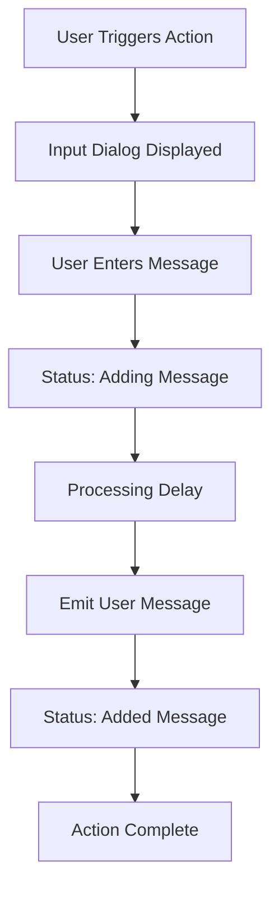

# 💬 Example Action

> **Interactive message input action for OpenWebUI with real-time status updates**

[](https://github.com/open-webui/functions)
[](https://github.com/open-webui/open-webui)
[](LICENSE)
[](https://www.python.org)

---

## 🌟 Overview

**Example Action** is a foundational OpenWebUI action that demonstrates interactive user input capabilities with real-time status updates. This action provides a clean interface for collecting user messages and displaying them with proper event handling and status feedback.

### ✨ Key Features

- 📝 **Interactive Input** - Clean modal dialog for message collection
- ⚡ **Real-time Status** - Live status updates during processing
- 🔄 **Async Processing** - Non-blocking operation with proper event handling
- 💫 **Event Emitter Integration** - Native OpenWebUI event system support
- 🎯 **Simple & Extensible** - Perfect foundation for custom actions
- 🛡️ **Error Handling** - Robust async operation management

---

## 📋 Table of Contents

- [🚀 Quick Start](#-quick-start)
- [🏗️ Installation](#️-installation)
- [🎯 Core Concepts](#-core-concepts)
  - [Action Architecture](#action-architecture)
  - [Event System](#event-system)
  - [Async Processing](#async-processing)
- [🛠️ Configuration](#️-configuration)
  - [Basic Settings](#basic-settings)
  - [Advanced Options](#advanced-options)
- [💡 Usage Guide](#-usage-guide)
  - [Basic Usage](#basic-usage)
  - [Status Messages](#status-messages)
  - [Event Handling](#event-handling)
- [🏗️ System Architecture](#️-system-architecture)
  - [Code Structure](#code-structure)
  - [Event Flow](#event-flow)
  - [Response Handling](#response-handling)
- [🔧 Troubleshooting](#-troubleshooting)
- [🚀 Advanced Features](#-advanced-features)
- [🤝 Contributing](#-contributing)

---

## 🚀 Quick Start

### 1️⃣ Install the Action
1. Copy the complete action code
2. Add as a new action in OpenWebUI
3. Enable the action in your workspace

### 2️⃣ Trigger the Action
- Click the action button in the chat interface
- Or use the action through the OpenWebUI actions menu

### 3️⃣ Enter Your Message
- Fill in the input dialog that appears
- Click submit to process your message

### 4️⃣ View Real-time Updates
- Watch status updates as the action processes
- See your message displayed in the chat

---

## 🏗️ Installation

### Prerequisites
- OpenWebUI version 0.3.9 or higher
- Python 3.8+ environment
- Administrator access to add actions

### Step-by-Step Installation

1. **Access Action Management**
   - Navigate to OpenWebUI Settings
   - Go to Admin Panel → Actions
   - Click "Add Action"

2. **Install Example Action**
   - Copy the complete action code
   - Paste into the action editor
   - Set action name: "Example Action"
   - Save and enable the action

3. **Verify Installation**
   - Check that the action appears in your actions list
   - Test by triggering the action in a chat
   - Confirm input dialog appears correctly

---

## 🎯 Core Concepts

### Action Architecture

The **Example Action** follows OpenWebUI's standard action pattern:

#### 🏗️ Component Structure
```python
class Action:
    class Valves(BaseModel):
        # Configuration settings (currently empty)
        pass
    
    def __init__(self):
        # Initialize action with valve settings
        self.valves = self.Valves()
    
    async def action(self, body, __user__, __event_emitter__, __event_call__):
        # Main action logic with async processing
```

#### 🔧 Core Components
- **Valves**: Configuration management system
- **Event Emitter**: Real-time status and message broadcasting
- **Event Call**: Interactive input collection
- **Async Processing**: Non-blocking operation handling

### Event System

The action integrates deeply with OpenWebUI's event system:

#### 📡 Event Types
| Event Type | Purpose | Data Structure |
|------------|---------|----------------|
| `input` | Collect user input | `{title, message, placeholder}` |
| `status` | Show processing state | `{description, done}` |
| `message` | Display content | `{content}` |

#### 🔄 Event Flow
1. **Input Request** → User sees modal dialog
2. **Status Update** → "adding message" with progress indicator  
3. **Processing Delay** → Simulated work with `asyncio.sleep(1)`
4. **Message Emission** → User input displayed in chat
5. **Completion Status** → "added message" with done flag

### Async Processing

#### ⚡ Async Benefits
- **Non-blocking UI** - Interface remains responsive
- **Parallel Operations** - Multiple actions can run simultaneously
- **Real-time Updates** - Status changes broadcast immediately
- **Error Isolation** - Failed actions don't crash the system

---

## 🛠️ Configuration

### Basic Settings

#### 🎛️ Valves Configuration
```python
class Valves(BaseModel):
    # Currently no configuration options
    # Can be extended for customization
    pass
```

The Example Action currently uses minimal configuration, making it perfect for:
- **Learning & Development** - Simple structure for understanding actions
- **Prototyping** - Quick foundation for custom actions
- **Testing** - Reliable base for experimenting with features

### Advanced Options

#### 🔧 Potential Extensions
```python
class Valves(BaseModel):
    input_title: str = Field(default="write a message", description="Title for input dialog")
    input_message: str = Field(default="here write a message to append", description="Input dialog message")
    input_placeholder: str = Field(default="enter your message", description="Input placeholder text")
    processing_delay: float = Field(default=1.0, description="Simulated processing delay in seconds")
    status_adding: str = Field(default="adding message", description="Status message while processing")
    status_completed: str = Field(default="added message", description="Status message when done")
```

---

## 💡 Usage Guide

### Basic Usage

#### 🎯 Triggering the Action
1. **From Chat Interface**
   - Click the actions button in the chat
   - Select "Example Action" from the menu
   - Action will immediately prompt for input

2. **Action Flow**
   ```
   User Clicks Action → Input Dialog → User Types → Processing → Message Display
   ```

#### 📝 Input Dialog
The action presents a user-friendly input interface:
- **Title**: "write a message"
- **Message**: "here write a message to append"  
- **Placeholder**: "enter your message"
- **Input Field**: Text area for user message

### Status Messages

#### 🔄 Processing Feedback
The action provides real-time status updates:

1. **Initial Status**: "adding message" (done: false)
   - Shows processing spinner
   - Indicates work in progress

2. **Final Status**: "added message" (done: true)
   - Confirms completion
   - Removes loading indicator

### Event Handling

#### 📡 Event Sequence
```python
# 1. Collect input
response = await __event_call__({
    "type": "input",
    "data": {
        "title": "write a message",
        "message": "here write a message to append", 
        "placeholder": "enter your message"
    }
})

# 2. Show processing status
await __event_emitter__({
    "type": "status",
    "data": {"description": "adding message", "done": False}
})

# 3. Simulate processing
await asyncio.sleep(1)

# 4. Emit user message
await __event_emitter__({
    "type": "message", 
    "data": {"content": response}
})

# 5. Show completion status
await __event_emitter__({
    "type": "status",
    "data": {"description": "added message", "done": True}
})
```

---

## 🏗️ System Architecture

### Code Structure

```
Example Action/
├── Action Class
│   ├── Valves (Configuration)
│   ├── __init__ (Initialization)
│   └── action() (Main Logic)
├── Dependencies
│   ├── pydantic (Data Validation)
│   ├── typing (Type Hints)
│   ├── os (System Access)
│   ├── requests (HTTP Requests)
│   └── asyncio (Async Operations)
└── Event Integration
    ├── __event_emitter__ (Status/Messages)
    ├── __event_call__ (User Input)
    └── __user__ (User Context)
```

### Event Flow

#### 🔄 Processing Pipeline


### Response Handling

#### 📨 Response Types
- **Input Response** - User's message text
- **Status Response** - Processing state updates
- **Message Response** - Content displayed in chat
- **Error Response** - Exception handling (implicit)

---

## 🔧 Troubleshooting

### Common Issues

#### ❌ Action Not Appearing
**Problem**: Example Action doesn't show in actions menu
```
Solution: Verify installation and permissions
1. Check action is properly saved in OpenWebUI
2. Ensure action is enabled
3. Refresh browser/restart OpenWebUI
4. Verify minimum version requirement (0.3.9+)
```

#### ❌ Input Dialog Not Opening
**Problem**: Clicking action doesn't show input dialog
```
Solution: Check event call configuration
1. Verify __event_call__ is available
2. Check browser console for JavaScript errors
3. Test with a fresh browser session
4. Ensure OpenWebUI is up to date
```

#### ❌ Status Updates Not Showing
**Problem**: No status messages during processing
```
Solution: Verify event emitter functionality
1. Check __event_emitter__ is available
2. Ensure status data structure is correct
3. Verify async/await syntax is proper
4. Test with simpler status messages
```

### Debug Mode

#### 🐛 Adding Debug Output
```python
async def action(self, body: dict, __user__=None, __event_emitter__=None, __event_call__=None):
    print(f"action:{__name__}")  # Current debug output
    print(f"User: {__user__}")   # Add user debug info
    print(f"Body: {body}")       # Add body debug info
    
    # Your existing code...
```

#### 📊 Debug Information
- **Action Name** - Confirms action is executing
- **User Context** - Validates user permissions
- **Request Body** - Shows incoming data structure
- **Event Responses** - Logs event call results

---

## 🚀 Advanced Features

### Custom Extensions

#### 🎨 Enhanced Input Validation
```python
from pydantic import BaseModel, Field, validator

class Valves(BaseModel):
    min_message_length: int = Field(default=1, description="Minimum message length")
    max_message_length: int = Field(default=1000, description="Maximum message length")
    
    @validator('min_message_length')
    def validate_min_length(cls, v):
        if v < 1:
            raise ValueError('Minimum length must be at least 1')
        return v
```

#### 🔧 Message Processing
```python
async def action(self, body: dict, __user__=None, __event_emitter__=None, __event_call__=None):
    # Enhanced input validation
    if len(response) < self.valves.min_message_length:
        await __event_emitter__({
            "type": "status",
            "data": {"description": "Message too short", "done": True}
        })
        return
    
    # Message transformation
    processed_message = f"📝 {__user__.get('name', 'User')}: {response}"
    
    # Enhanced status updates
    await __event_emitter__({
        "type": "message",
        "data": {"content": processed_message}
    })
```

### Integration Patterns

#### 🔗 API Integration
```python
import requests

async def action(self, body: dict, **kwargs):
    # External API call example
    api_response = requests.get("https://api.example.com/process", 
                               json={"message": response})
    
    # Process API response
    if api_response.status_code == 200:
        result = api_response.json()
        await __event_emitter__({
            "type": "message",
            "data": {"content": f"API Result: {result}"}
        })
```

#### 🗄️ Data Storage
```python
import os
import json

async def action(self, body: dict, **kwargs):
    # Save message to file
    data_dir = "/app/backend/data/messages"
    os.makedirs(data_dir, exist_ok=True)
    
    message_data = {
        "timestamp": datetime.now().isoformat(),
        "user": __user__.get('name', 'Unknown'),
        "message": response
    }
    
    with open(f"{data_dir}/messages.jsonl", "a") as f:
        f.write(json.dumps(message_data) + "\n")
```

---

## 🤝 Contributing

### Development Setup

#### 🛠️ Local Development
1. **Clone Repository** - Set up local OpenWebUI development environment
2. **Install Dependencies** - Ensure pydantic, asyncio are available
3. **Test Changes** - Use OpenWebUI development instance
4. **Submit PR** - Follow OpenWebUI contribution guidelines

### Action Guidelines

#### 📝 Best Practices
- **Clear Purpose** - Well-defined action functionality
- **Proper Async** - Use async/await correctly
- **Error Handling** - Graceful failure management
- **User Feedback** - Informative status messages
- **Code Documentation** - Clear comments and docstrings

#### 🧪 Testing Requirements
- **Functionality** - Action works as expected
- **Performance** - No blocking operations
- **Compatibility** - Works with target OpenWebUI version
- **Error Handling** - Graceful failure modes

### Bug Reports

#### 🐛 Reporting Issues
Include the following information:
- **OpenWebUI Version** - Your OpenWebUI version
- **Action Code** - Complete action implementation
- **Error Messages** - Full error text and console logs
- **Reproduction Steps** - How to recreate the issue
- **Expected Behavior** - What should happen instead

---

## 📄 License

This project is licensed under the MIT License - see the [LICENSE](LICENSE) file for details.

---

## 🙏 Acknowledgments

- **OpenWebUI Team** - For the amazing platform and action system
- **Community Contributors** - For feedback and improvements
- **Beta Testers** - For early testing and bug reports

---

## 📞 Support

- **GitHub Issues** - [Report bugs and request features](https://github.com/open-webui/functions/issues)
- **Discussions** - [Community support and questions](https://github.com/open-webui/functions/discussions)
- **Documentation** - [OpenWebUI Actions Documentation](https://docs.openwebui.com)

---

<div align="center">

**💬 Enhance your OpenWebUI experience with interactive actions!**

*Simple setup • Real-time feedback • Extensible foundation*

</div>