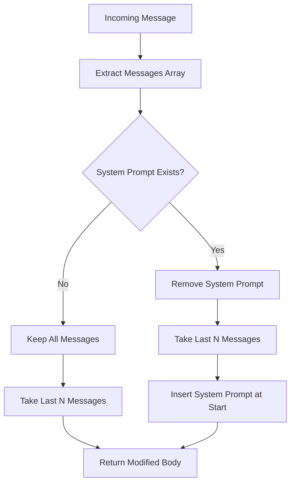

# ✂️ Context Clip Filter

> **Intelligent conversation context management for OpenWebUI with system prompt preservation**

[](https://github.com/open-webui/functions)
[](https://github.com/open-webui/open-webui)
[](LICENSE)
[](https://www.python.org)

---

## 🌟 Overview

**Context Clip Filter** is an essential OpenWebUI filter that automatically manages conversation context length by intelligently truncating message history while preserving critical system prompts. This filter ensures optimal performance and prevents context overflow without losing important conversation setup.

### ✨ Key Features

- ✂️ **Smart Truncation** - Automatically limits conversation history to the last N messages
- 🛡️ **System Prompt Preservation** - Always maintains system prompts regardless of truncation
- ⚙️ **Configurable Limits** - Customizable message retention count
- 🎯 **Priority Control** - Filter execution order management
- 🔄 **Transparent Operation** - Seamless integration with existing conversations
- ⚡ **Performance Optimized** - Reduces context size for faster processing
- 🧠 **Memory Management** - Prevents context window overflow

---

## 📋 Table of Contents

- [🚀 Quick Start](#-quick-start)
- [🏗️ Installation](#️-installation)
- [🎯 Core Concepts](#-core-concepts)
  - [Filter Architecture](#filter-architecture)
  - [Context Management](#context-management)
  - [System Prompt Handling](#system-prompt-handling)
- [🛠️ Configuration](#️-configuration)
  - [Basic Settings](#basic-settings)
  - [Advanced Options](#advanced-options)
  - [User-Specific Settings](#user-specific-settings)
- [💡 Usage Guide](#-usage-guide)
  - [Basic Operation](#basic-operation)
  - [Message Retention](#message-retention)
  - [System Prompt Behavior](#system-prompt-behavior)
- [🏗️ System Architecture](#️-system-architecture)
  - [Filter Flow](#filter-flow)
  - [Message Processing](#message-processing)
  - [Context Preservation](#context-preservation)
- [🔧 Troubleshooting](#-troubleshooting)
- [🚀 Advanced Features](#-advanced-features)
- [🤝 Contributing](#-contributing)

---

## 🚀 Quick Start

### 1️⃣ Install the Filter
1. Copy the complete filter code
2. Add as a new filter in OpenWebUI
3. Configure message retention limit
4. Enable the filter for your conversations

### 2️⃣ Configure Message Limit
- Set `n_last_messages` to your desired conversation length
- Default: 4 messages (keeps conversations focused)
- Adjust based on your use case and model context limits

### 3️⃣ Set Filter Priority
- Configure `priority` to control execution order
- Default: 0 (standard priority)
- Higher numbers = later execution

### 4️⃣ Start Conversing
- Filter operates automatically on every message
- System prompts are always preserved
- Older messages automatically removed

---

## 🏗️ Installation

### Prerequisites
- OpenWebUI instance with filter support
- Administrator access to add filters
- Understanding of conversation context management

### Step-by-Step Installation

1. **Access Filter Management**
   - Navigate to OpenWebUI Settings
   - Go to Admin Panel → Filters
   - Click "Add Filter"

2. **Install Context Clip Filter**
   - Copy the complete filter code
   - Paste into the filter editor
   - Set filter name: "Context Clip Filter"
   - Save and enable the filter

3. **Configure Settings**
   - Set `n_last_messages` (default: 4)
   - Configure `priority` if using multiple filters
   - Enable for desired chat sessions

4. **Verify Operation**
   - Start a new conversation
   - Send more messages than your limit
   - Confirm older messages are automatically removed

---

## 🎯 Core Concepts

### Filter Architecture

The **Context Clip Filter** operates as an inlet filter in OpenWebUI's processing pipeline:

#### 🏗️ Component Structure
```python
class Filter:
    class Valves(BaseModel):
        priority: int = 0           # Filter execution order
        n_last_messages: int = 4    # Message retention limit
    
    class UserValves(BaseModel):
        pass                        # User-specific settings (extensible)
    
    def inlet(self, body: dict, __user__: Optional[dict] = None) -> dict:
        # Main filtering logic
```

#### 🔧 Core Components
- **Valves**: Global configuration settings
- **UserValves**: User-specific customization options
- **Inlet Method**: Message processing pipeline entry point
- **Priority System**: Execution order control

### Context Management

The filter implements intelligent context window management:

#### 📏 Context Size Control
| Scenario | Behavior | Result |
|----------|----------|---------|
| **With System Prompt** | Preserve system + last N messages | System prompt + 4 recent messages |
| **Without System Prompt** | Keep last N messages only | Last 4 messages |
| **Fewer than N Messages** | No truncation needed | All messages preserved |

#### 🧠 Memory Benefits
- **Reduced Token Usage** - Lower API costs and faster responses
- **Consistent Performance** - Prevents context window overflow
- **Focused Conversations** - Maintains recent context relevance
- **Model Efficiency** - Optimal input size for AI processing

### System Prompt Handling

#### 🛡️ Preservation Strategy
```python
# 1. Identify system prompt
system_prompt = next(
    (message for message in messages if message.get("role") == "system"), None
)

# 2. Separate system prompt from conversation
if system_prompt:
    messages = [msg for msg in messages if msg.get("role") != "system"]
    messages = messages[-self.valves.n_last_messages:]
    messages.insert(0, system_prompt)  # Always first
```

#### 🎯 System Prompt Priority
- **Always Preserved** - Never removed regardless of conversation length
- **Position Maintained** - Always placed at the beginning
- **Role Recognition** - Identified by `"role": "system"` attribute
- **Single Instance** - Only first system prompt is preserved

---

## 🛠️ Configuration

### Basic Settings

#### 🎛️ Core Configuration
| Setting | Default | Description | Range |
|---------|---------|-------------|-------|
| `priority` | `0` | Filter execution order | `-100` to `100` |
| `n_last_messages` | `4` | Messages to retain | `1` to `50` |

#### 📊 Message Limit Guidelines
| Use Case | Recommended Limit | Reasoning |
|----------|------------------|-----------|
| **Quick Q&A** | `2-3` | Focus on immediate context |
| **General Chat** | `4-6` | Balance context and efficiency |
| **Complex Discussions** | `8-12` | Maintain detailed context |
| **Long-form Analysis** | `15-20` | Preserve comprehensive history |

### Advanced Options

#### 🔧 Extended Configuration
```python
class Valves(BaseModel):
    priority: int = Field(default=0, ge=-100, le=100)
    n_last_messages: int = Field(default=4, ge=1, le=50)
    preserve_system_prompt: bool = Field(default=True, description="Always keep system prompt")
    enable_user_override: bool = Field(default=False, description="Allow user-specific limits")
    min_messages_before_clip: int = Field(default=5, description="Minimum messages before clipping starts")
```

#### ⚙️ Priority Settings
- **Negative Priority** (-10): Execute early in pipeline
- **Zero Priority** (0): Standard execution order
- **Positive Priority** (+10): Execute late in pipeline

### User-Specific Settings

#### 👤 UserValves Extension
```python
class UserValves(BaseModel):
    custom_message_limit: Optional[int] = Field(default=None, description="User-specific message limit")
    bypass_filter: bool = Field(default=False, description="Disable filtering for this user")
```

---

## 💡 Usage Guide

### Basic Operation

#### 🔄 Automatic Processing
The filter operates transparently on every conversation:

1. **Message Received** - New user message enters pipeline
2. **Filter Applied** - Context clip logic executes
3. **Context Trimmed** - Older messages removed if necessary
4. **System Prompt Preserved** - Always maintained at start
5. **Processing Continues** - Modified context sent to AI model

#### 📝 Example Conversation Flow
```
Initial: [System, User1, AI1, User2, AI2, User3, AI3, User4, AI4, User5]
After:   [System, User3, AI3, User4, AI4, User5]
Result:  System prompt + last 4 messages retained
```

### Message Retention

#### 📏 Retention Scenarios

**Scenario 1: With System Prompt (n_last_messages = 4)**
```
Before: [System, Msg1, Msg2, Msg3, Msg4, Msg5, Msg6]
After:  [System, Msg3, Msg4, Msg5, Msg6]
```

**Scenario 2: Without System Prompt (n_last_messages = 4)**
```
Before: [Msg1, Msg2, Msg3, Msg4, Msg5, Msg6]
After:  [Msg3, Msg4, Msg5, Msg6]
```

**Scenario 3: Fewer Messages Than Limit**
```
Before: [System, Msg1, Msg2]
After:  [System, Msg1, Msg2] (no change)
```

### System Prompt Behavior

#### 🛡️ Preservation Rules
- **Always First** - System prompt maintains position zero
- **Never Counted** - Doesn't count toward message limit
- **Single Instance** - Only first system prompt preserved
- **Role-Based Detection** - Identified by `role: "system"`

---

## 🏗️ System Architecture

### Filter Flow

#### 🔄 Processing Pipeline


### Message Processing

#### 📨 Message Structure
```python
# Input message structure
{
    "messages": [
        {"role": "system", "content": "You are a helpful assistant"},
        {"role": "user", "content": "Hello"},
        {"role": "assistant", "content": "Hi there!"},
        {"role": "user", "content": "How are you?"}
    ]
}
```

#### ✂️ Clipping Logic
```python
def inlet(self, body: dict, __user__: Optional[dict] = None) -> dict:
    messages = body["messages"]
    
    # Find and preserve system prompt
    system_prompt = next(
        (msg for msg in messages if msg.get("role") == "system"), None
    )
    
    if system_prompt:
        # Remove system prompt, clip messages, then re-insert
        messages = [msg for msg in messages if msg.get("role") != "system"]
        messages = messages[-self.valves.n_last_messages:]
        messages.insert(0, system_prompt)
    else:
        # Simple truncation without system prompt
        messages = messages[-self.valves.n_last_messages:]
    
    body["messages"] = messages
    return body
```

### Context Preservation

#### 🧠 Memory Strategy
- **Sliding Window** - Maintains most recent conversation context
- **System Prompt Anchor** - Preserves AI behavior instructions
- **Token Efficiency** - Reduces input size without losing meaning
- **Performance Optimization** - Faster processing with smaller context

---

## 🔧 Troubleshooting

### Common Issues

#### ❌ Filter Not Working
**Problem**: Messages not being clipped despite configuration
```
Solution: Verify filter installation and activation
1. Check filter is enabled in OpenWebUI settings
2. Verify filter priority doesn't conflict with others
3. Confirm n_last_messages is set correctly
4. Test with a fresh conversation
```

#### ❌ System Prompt Disappearing
**Problem**: System prompt gets removed unexpectedly
```
Solution: Check system prompt format
1. Ensure role is exactly "system" (lowercase)
2. Verify system prompt is properly formatted JSON
3. Check for multiple system prompts (only first preserved)
4. Validate message structure integrity
```

#### ❌ Too Aggressive Clipping
**Problem**: Important context being lost too quickly
```
Solution: Adjust message retention settings
1. Increase n_last_messages value
2. Consider conversation type and needs
3. Monitor token usage vs. context retention
4. Test different limits for optimal balance
```

### Debug Mode

#### 🐛 Adding Debug Output
```python
def inlet(self, body: dict, __user__: Optional[dict] = None) -> dict:
    messages = body["messages"]
    original_count = len(messages)
    
    print(f"Context Clip: Processing {original_count} messages")
    
    # Existing logic...
    
    final_count = len(body["messages"])
    print(f"Context Clip: Retained {final_count} messages")
    
    return body
```

#### 📊 Debug Information
- **Message Counts** - Before and after processing
- **System Prompt Detection** - Whether system prompt found
- **Truncation Applied** - Whether clipping occurred
- **User Context** - User-specific settings applied

---

## 🚀 Advanced Features

### Dynamic Message Limits

#### 🎯 Context-Aware Adjustment
```python
def inlet(self, body: dict, __user__: Optional[dict] = None) -> dict:
    # Adjust limit based on conversation type
    if self.detect_complex_conversation(body["messages"]):
        limit = self.valves.n_last_messages * 2
    else:
        limit = self.valves.n_last_messages
    
    # Apply dynamic limit
    messages = self.apply_clipping(body["messages"], limit)
    body["messages"] = messages
    return body
```

#### 🔧 Smart Preservation
```python
def preserve_important_messages(self, messages: list) -> list:
    # Keep messages with specific markers
    important_messages = [
        msg for msg in messages 
        if "IMPORTANT:" in msg.get("content", "") or
           msg.get("role") == "system"
    ]
    
    # Merge with recent messages
    recent_messages = messages[-self.valves.n_last_messages:]
    
    return self.merge_and_deduplicate(important_messages, recent_messages)
```

### Integration Patterns

#### 🔗 Multi-Filter Coordination
```python
class Valves(BaseModel):
    priority: int = Field(default=10, description="Execute after content filters")
    coordinate_with_filters: List[str] = Field(
        default=["content_filter", "safety_filter"],
        description="Filters to coordinate with"
    )
```

#### 📊 Analytics Integration
```python
def inlet(self, body: dict, __user__: Optional[dict] = None) -> dict:
    # Track clipping statistics
    self.log_context_metrics(
        user_id=__user__.get("id") if __user__ else None,
        original_length=len(body["messages"]),
        clipped_length=len(clipped_messages),
        timestamp=datetime.now()
    )
    
    return body
```

### Performance Optimization

#### ⚡ Efficient Processing
```python
def inlet(self, body: dict, __user__: Optional[dict] = None) -> dict:
    messages = body["messages"]
    
    # Early exit if no clipping needed
    if len(messages) <= self.valves.n_last_messages:
        return body
    
    # Optimized system prompt detection
    system_indices = [
        i for i, msg in enumerate(messages) 
        if msg.get("role") == "system"
    ]
    
    if system_indices:
        # Efficient slicing and reconstruction
        system_prompt = messages[system_indices[0]]
        other_messages = [
            msg for i, msg in enumerate(messages) 
            if i not in system_indices
        ]
        messages = [system_prompt] + other_messages[-self.valves.n_last_messages:]
    else:
        messages = messages[-self.valves.n_last_messages:]
    
    body["messages"] = messages
    return body
```

---

## 🤝 Contributing

### Development Setup

#### 🛠️ Local Development
1. **Clone Repository** - Set up local OpenWebUI development environment
2. **Install Dependencies** - Ensure pydantic is available
3. **Test Changes** - Use OpenWebUI development instance
4. **Submit PR** - Follow OpenWebUI contribution guidelines

### Filter Guidelines

#### 📝 Best Practices
- **Efficient Processing** - Minimize computational overhead
- **Preserve Intent** - Maintain conversation meaning
- **Configurable Behavior** - Allow user customization
- **Error Handling** - Graceful failure management
- **Documentation** - Clear code comments and docstrings

#### 🧪 Testing Requirements
- **Functionality** - Filter works as expected
- **Performance** - No significant processing delays
- **Compatibility** - Works with various message formats
- **Edge Cases** - Handles empty messages, malformed data

### Feature Requests

#### 💡 Enhancement Ideas
- **Smart Message Importance Detection** - Preserve key conversation points
- **User-Specific Limits** - Per-user context preferences
- **Conversation Type Detection** - Adaptive limits based on content
- **Analytics Dashboard** - Context usage statistics
- **Integration APIs** - Hooks for other filters

---

## 📄 License

This project is licensed under the MIT License - see the [LICENSE](LICENSE) file for details.

---

## 🙏 Acknowledgments

- **OpenWebUI Team** - For the robust filter system architecture
- **Community Contributors** - For feedback and optimization suggestions
- **Beta Testers** - For real-world usage testing and bug reports

---

## 📞 Support

- **GitHub Issues** - [Report bugs and request features](https://github.com/open-webui/functions/issues)
- **Discussions** - [Community support and questions](https://github.com/open-webui/functions/discussions)
- **Documentation** - [OpenWebUI Filters Documentation](https://docs.openwebui.com)

---

<div align="center">

**✂️ Optimize your AI conversations with intelligent context management!**

*Smart truncation • System prompt preservation • Performance focused*

</div>