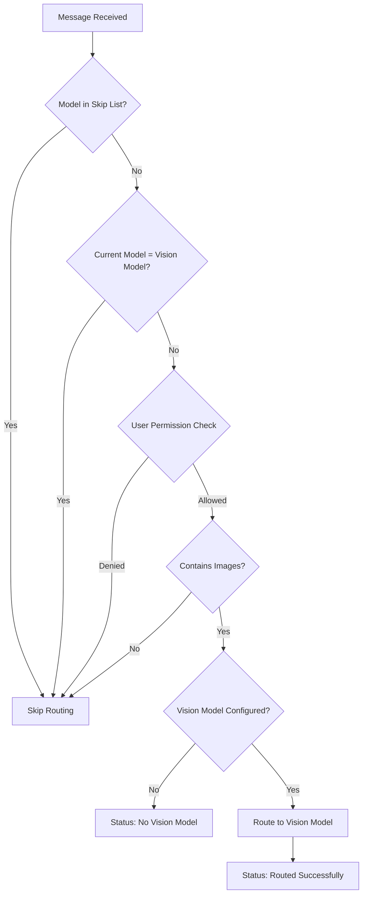

# 👁️ Dynamic Vision Router

> **Intelligent image-aware model routing for OpenWebUI with provider-specific compatibility**

[](https://github.com/open-webui/functions)
[](https://github.com/open-webui/open-webui)
[](LICENSE)
[](https://www.python.org)

---

## 🌟 Overview

**Dynamic Vision Router** is an intelligent OpenWebUI filter that automatically detects image content in conversations and seamlessly routes requests to specialized vision models. This filter ensures optimal image processing by switching to vision-capable models while maintaining provider compatibility and user role permissions.

### ✨ Key Features

- 🔄 **Automatic Image Detection** - Detects images in both direct uploads and image_url content
- 🎯 **Smart Model Routing** - Automatically switches to configured vision models
- 🛡️ **Provider Compatibility** - Respects provider boundaries (Ollama ↔ Ollama, OpenAI ↔ OpenAI)
- 👥 **Role-Based Control** - Separate settings for admin and regular users
- ⚙️ **Skip Lists** - Configurable models that bypass routing
- 📊 **Status Updates** - Real-time routing notifications
- 🔍 **Multi-Format Support** - Handles various image input formats
- ⚡ **Performance Optimized** - Efficient image detection and routing

---

## 📋 Table of Contents

- [🚀 Quick Start](#-quick-start)
- [🏗️ Installation](#️-installation)
- [🎯 Core Concepts](#-core-concepts)
  - [Filter Architecture](#filter-architecture)
  - [Image Detection](#image-detection)
  - [Provider Compatibility](#provider-compatibility)
- [🛠️ Configuration](#️-configuration)
  - [Basic Settings](#basic-settings)
  - [Advanced Options](#advanced-options)
  - [Role-Based Permissions](#role-based-permissions)
- [💡 Usage Guide](#-usage-guide)
  - [Basic Operation](#basic-operation)
  - [Model Routing](#model-routing)
  - [Status Notifications](#status-notifications)
- [🏗️ System Architecture](#️-system-architecture)
  - [Routing Logic](#routing-logic)
  - [Image Detection Flow](#image-detection-flow)
  - [Provider Matching](#provider-matching)
- [🔧 Troubleshooting](#-troubleshooting)
- [🚀 Advanced Features](#-advanced-features)
- [🤝 Contributing](#-contributing)

---

## 🚀 Quick Start

### 1️⃣ Install the Filter
1. Copy the complete filter code
2. Add as a new filter in OpenWebUI
3. Configure your vision model ID
4. Enable the filter for your users

### 2️⃣ Configure Vision Model
- Set `vision_model_id` to your preferred vision model
- Example: `"llava:latest"` for Ollama or `"gpt-4-vision-preview"` for OpenAI
- Ensure provider compatibility (Ollama models route to Ollama models)

### 3️⃣ Set User Permissions
- Enable `enabled_for_users` for regular user access
- Configure `enabled_for_admins` based on admin needs
- Default: enabled for users, disabled for admins

### 4️⃣ Test Image Routing
- Upload an image or send image_url content
- Watch automatic routing to your vision model
- Enable `status` to see routing notifications

---

## 🏗️ Installation

### Prerequisites
- OpenWebUI version 0.3.8 or higher
- Access to vision-capable models (Ollama LLaVA, OpenAI GPT-4V, etc.)
- Administrator access to add filters
- Understanding of model provider compatibility

### Step-by-Step Installation

1. **Access Filter Management**
   - Navigate to OpenWebUI Settings
   - Go to Admin Panel → Filters
   - Click "Add Filter"

2. **Install Dynamic Vision Router**
   - Copy the complete filter code
   - Paste into the filter editor
   - Set filter name: "Dynamic Vision Router"
   - Save and enable the filter

3. **Configure Vision Model**
   - Set `vision_model_id` to your vision model
   - Examples:
     - Ollama: `"llava:13b"`, `"bakllava:latest"`
     - OpenAI: `"gpt-4-vision-preview"`, `"gpt-4o"`
     - Other providers: Check compatibility

4. **Set Permissions**
   - Configure `enabled_for_users` (default: true)
   - Configure `enabled_for_admins` (default: false)
   - Adjust based on your organization's needs

5. **Test Routing**
   - Upload an image in a conversation
   - Verify routing occurs to the vision model
   - Check status messages if enabled

---

## 🎯 Core Concepts

### Filter Architecture

The **Dynamic Vision Router** operates as an inlet filter with intelligent routing capabilities:

#### 🏗️ Component Structure
```python
class Filter:
    class Valves(BaseModel):
        priority: int = 0                    # Filter execution order
        vision_model_id: str = ""           # Target vision model
        skip_reroute_models: list[str] = [] # Models to skip
        enabled_for_admins: bool = False    # Admin user control
        enabled_for_users: bool = True      # Regular user control
        status: bool = False                # Status notifications
    
    async def inlet(self, body, __event_emitter__, __model__, __user__):
        # Intelligent routing logic
```

#### 🔧 Core Components
- **Image Detection Engine** - Identifies visual content in messages
- **Provider Compatibility Checker** - Ensures proper model routing
- **Role-Based Access Control** - User permission management
- **Status Notification System** - Real-time routing feedback
- **Skip List Processor** - Model exclusion handling

### Image Detection

The filter implements comprehensive image detection across multiple formats:

#### 🖼️ Supported Image Formats
| Format Type | Detection Method | Example |
|-------------|------------------|---------|
| **Direct Upload** | `images` property | User uploads image file |
| **Image URL Content** | `image_url` type in content | Structured image references |
| **Base64 Images** | Embedded data URLs | Inline image data |

#### 🔍 Detection Logic
```python
# Check for direct image uploads
has_images = user_message.get("images") is not None

# Check for image_url content type
if not has_images and isinstance(user_message_content, list):
    has_images = any(
        item.get("type") == "image_url" for item in user_message_content
    )
```

### Provider Compatibility

#### 🔗 Provider Boundaries
**Critical**: The filter respects provider-specific compatibility:

- **Ollama Models** → Can only route to other Ollama models
- **OpenAI Models** → Can only route to other OpenAI models  
- **Other Providers** → Must route within same provider ecosystem

#### ⚠️ Compatibility Matrix
| Source Provider | Compatible Vision Models | Examples |
|----------------|-------------------------|----------|
| **Ollama** | Ollama vision models | `llava:latest`, `bakllava:7b` |
| **OpenAI** | OpenAI vision models | `gpt-4-vision-preview`, `gpt-4o` |
| **Anthropic** | Anthropic vision models | `claude-3-sonnet`, `claude-3-opus` |
| **Local** | Local vision models | Custom deployed models |

---

## 🛠️ Configuration

### Basic Settings

#### 🎛️ Essential Configuration
| Setting | Default | Description | Example |
|---------|---------|-------------|---------|
| `vision_model_id` | `""` | Target vision model identifier | `"llava:13b"` |
| `priority` | `0` | Filter execution order | `0` to `100` |
| `status` | `false` | Enable status notifications | `true`/`false` |

#### 🎯 Vision Model Examples
```python
# Ollama Models
vision_model_id = "llava:latest"
vision_model_id = "llava:13b"
vision_model_id = "bakllava:7b"

# OpenAI Models  
vision_model_id = "gpt-4-vision-preview"
vision_model_id = "gpt-4o"
vision_model_id = "gpt-4-turbo"

# Other Providers
vision_model_id = "claude-3-sonnet-20240229"
```

### Advanced Options

#### 🔧 Skip List Configuration
```python
skip_reroute_models = [
    "gpt-4-vision-preview",  # Already a vision model
    "llava:latest",          # Skip if already using vision
    "custom-vision-model",   # Custom models to exclude
]
```

#### 📊 Priority and Performance
```python
priority = 10  # Execute after other filters
status = True  # Show routing notifications
```

### Role-Based Permissions

#### 👥 User Role Configuration
| Setting | Default | Use Case |
|---------|---------|----------|
| `enabled_for_users` | `true` | Regular users can use vision routing |
| `enabled_for_admins` | `false` | Admins may prefer manual control |

#### 🛡️ Permission Scenarios
```python
# Scenario 1: Open access (default)
enabled_for_users = True
enabled_for_admins = False

# Scenario 2: Admin-only vision routing
enabled_for_users = False  
enabled_for_admins = True

# Scenario 3: Universal access
enabled_for_users = True
enabled_for_admins = True

# Scenario 4: Disabled (maintenance mode)
enabled_for_users = False
enabled_for_admins = False
```

---

## 💡 Usage Guide

### Basic Operation

#### 🔄 Automatic Routing Process
1. **User Sends Message** - Message contains image content
2. **Image Detection** - Filter identifies visual elements
3. **Permission Check** - Verifies user role permissions
4. **Model Routing** - Switches to configured vision model
5. **Status Update** - Shows routing notification (if enabled)
6. **Processing** - Vision model handles the request

#### 📸 Image Input Methods

**Method 1: Direct Upload**
- Drag and drop image files
- Use file picker to select images
- Paste images from clipboard

**Method 2: Image URLs**
- Reference external image URLs
- Structured content with image_url type
- Base64 encoded image data

### Model Routing

#### 🎯 Routing Scenarios

**Scenario 1: Text-Only Message**
```
Input: "Hello, how are you?"
Result: No routing (continues with current model)
```

**Scenario 2: Message with Image**
```
Input: "What's in this image?" + [uploaded image]
Result: Routes to vision_model_id
```

**Scenario 3: Skip List Model**
```
Current Model: "gpt-4-vision-preview" (in skip list)
Result: No routing (already appropriate model)
```

**Scenario 4: Permission Denied**
```
User: Admin with enabled_for_admins = False
Result: No routing (permission check fails)
```

### Status Notifications

#### 📊 Status Message Types

**Successful Routing**
```json
{
    "type": "status",
    "data": {
        "description": "Request routed to llava:13b",
        "done": true
    }
}
```

**Missing Configuration**
```json
{
    "type": "status", 
    "data": {
        "description": "No vision model ID provided, routing could not be completed.",
        "done": true
    }
}
```

---

## 🏗️ System Architecture

### Routing Logic

#### 🔄 Decision Flow


### Image Detection Flow

#### 🖼️ Detection Algorithm
```python
async def detect_images(self, user_message: dict) -> bool:
    # Method 1: Direct image uploads
    if user_message.get("images") is not None:
        return True
    
    # Method 2: Structured content with image_url
    content = user_message.get("content")
    if isinstance(content, list):
        return any(item.get("type") == "image_url" for item in content)
    
    return False
```

#### 🔍 Content Structure Examples
```python
# Direct images
{
    "role": "user",
    "content": "What's in this image?",
    "images": ["base64_image_data"]
}

# Image URL content
{
    "role": "user", 
    "content": [
        {"type": "text", "text": "Analyze this image:"},
        {"type": "image_url", "image_url": {"url": "https://..."}}
    ]
}
```

### Provider Matching

#### 🔗 Compatibility Enforcement
The filter ensures provider compatibility but doesn't enforce it directly - this is handled by OpenWebUI's model management system.

#### ⚙️ Best Practices
- **Ollama Setup**: Configure `vision_model_id` to Ollama vision models
- **OpenAI Setup**: Use OpenAI vision model identifiers
- **Mixed Environments**: Use separate filter instances per provider
- **Custom Models**: Ensure proper model registration in OpenWebUI

---

## 🔧 Troubleshooting

### Common Issues

#### ❌ Images Not Detected
**Problem**: Filter doesn't route despite images being present
```
Solution: Check image format and content structure
1. Verify images are properly uploaded/referenced
2. Check content structure for image_url types
3. Enable status messages to see detection results
4. Test with different image input methods
```

#### ❌ Vision Model Not Found
**Problem**: Routing fails with model not found error
```
Solution: Verify vision model configuration
1. Check vision_model_id is correct and available
2. Ensure model is registered in OpenWebUI
3. Verify provider compatibility (Ollama ↔ Ollama)
4. Test model independently before routing
```

#### ❌ Permission Issues
**Problem**: Routing doesn't work for certain users
```
Solution: Check role-based settings
1. Verify enabled_for_users/enabled_for_admins settings
2. Check user role assignment in OpenWebUI
3. Test with different user accounts
4. Review filter priority and conflicts
```

#### ❌ Status Messages Not Showing
**Problem**: No routing notifications despite status=true
```
Solution: Verify event emitter configuration
1. Ensure status is set to true in valves
2. Check __event_emitter__ is available
3. Verify OpenWebUI supports status events
4. Test with simple status messages
```

### Debug Mode

#### 🐛 Adding Debug Output
```python
async def inlet(self, body: dict, __event_emitter__, __model__, __user__) -> dict:
    print(f"Vision Router: Processing model {__model__['id']}")
    print(f"Vision Router: User role {__user__.get('role') if __user__ else 'None'}")
    
    user_message = get_last_user_message_item(body.get("messages", []))
    has_images = self.detect_images(user_message)
    print(f"Vision Router: Images detected: {has_images}")
    
    # Existing logic...
    
    if routing_occurred:
        print(f"Vision Router: Routed to {self.valves.vision_model_id}")
    
    return body
```

#### 📊 Debug Information
- **Model Processing** - Current model being processed
- **User Context** - User role and permissions  
- **Image Detection** - Whether images were found
- **Routing Decisions** - When and why routing occurs
- **Status Events** - Event emitter functionality

---

## 🚀 Advanced Features

### Multi-Provider Support

#### 🌐 Provider-Specific Configurations
```python
class Valves(BaseModel):
    # Provider-specific vision models
    ollama_vision_model: str = Field(default="llava:13b")
    openai_vision_model: str = Field(default="gpt-4-vision-preview")
    anthropic_vision_model: str = Field(default="claude-3-sonnet")
    
    # Auto-detect provider from current model
    auto_detect_provider: bool = Field(default=True)
```

#### 🔧 Dynamic Provider Detection
```python
def get_provider_from_model(self, model_id: str) -> str:
    if ":" in model_id:  # Ollama format
        return "ollama"
    elif model_id.startswith("gpt-"):
        return "openai"
    elif model_id.startswith("claude-"):
        return "anthropic"
    else:
        return "unknown"

def select_vision_model(self, current_model: str) -> str:
    provider = self.get_provider_from_model(current_model)
    
    vision_models = {
        "ollama": self.valves.ollama_vision_model,
        "openai": self.valves.openai_vision_model,
        "anthropic": self.valves.anthropic_vision_model
    }
    
    return vision_models.get(provider, self.valves.vision_model_id)
```

### Smart Image Analysis

#### 🧠 Content-Aware Routing
```python
def analyze_image_complexity(self, user_message: dict) -> str:
    content = user_message.get("content", "")
    
    # Determine appropriate vision model based on task
    if any(keyword in content.lower() for keyword in ["code", "diagram", "technical"]):
        return self.valves.technical_vision_model
    elif any(keyword in content.lower() for keyword in ["art", "creative", "style"]):
        return self.valves.creative_vision_model
    else:
        return self.valves.vision_model_id
```

#### 📊 Usage Analytics
```python
class Valves(BaseModel):
    # ... existing fields ...
    track_usage: bool = Field(default=False, description="Track routing statistics")
    usage_log_path: str = Field(default="/tmp/vision_routing.log")

def log_routing_event(self, user_id: str, source_model: str, target_model: str):
    if self.valves.track_usage:
        event = {
            "timestamp": datetime.now().isoformat(),
            "user_id": user_id,
            "source_model": source_model,
            "target_model": target_model
        }
        
        with open(self.valves.usage_log_path, "a") as f:
            f.write(json.dumps(event) + "\n")
```

### Integration Patterns

#### 🔗 Filter Chain Coordination
```python
class Valves(BaseModel):
    # ... existing fields ...
    coordinate_with_filters: list[str] = Field(
        default=["content_filter", "safety_filter"],
        description="Filters to coordinate with"
    )
    execute_after_safety: bool = Field(
        default=True,
        description="Execute after safety filters"
    )
```

#### 🎯 Model Performance Optimization
```python
def should_route_based_on_load(self, vision_model_id: str) -> bool:
    # Check model load/availability
    try:
        # Implement model availability check
        return self.check_model_availability(vision_model_id)
    except Exception:
        return False

def get_fallback_vision_model(self) -> str:
    fallback_models = [
        "llava:7b",      # Lighter fallback
        "gpt-4o-mini",   # Smaller OpenAI model
        "claude-3-haiku" # Faster Anthropic model
    ]
    
    for model in fallback_models:
        if self.check_model_availability(model):
            return model
    
    return self.valves.vision_model_id
```

---

## 🤝 Contributing

### Development Setup

#### 🛠️ Local Development
1. **Clone Repository** - Set up local OpenWebUI development environment
2. **Install Dependencies** - Ensure pydantic and OpenWebUI utils are available
3. **Test Changes** - Use OpenWebUI development instance with vision models
4. **Submit PR** - Follow OpenWebUI contribution guidelines

### Filter Guidelines

#### 📝 Best Practices
- **Provider Awareness** - Respect model provider boundaries
- **Efficient Detection** - Minimize image detection overhead
- **Graceful Fallbacks** - Handle missing models gracefully
- **User Experience** - Provide clear status feedback
- **Error Handling** - Robust error management and logging

#### 🧪 Testing Requirements
- **Multi-Provider Testing** - Test with Ollama, OpenAI, and other providers
- **Image Format Support** - Verify all image input methods work
- **Permission Testing** - Test admin/user role functionality
- **Edge Case Handling** - Test missing models, malformed content
- **Performance Impact** - Ensure minimal processing overhead

### Feature Requests

#### 💡 Enhancement Ideas
- **Multiple Vision Models** - Route to different models based on content type
- **Load Balancing** - Distribute vision requests across multiple models
- **Cache Integration** - Cache vision model responses for repeated images
- **Advanced Analytics** - Detailed usage statistics and performance metrics
- **Custom Providers** - Support for additional model providers

---

## 📄 License

This project is licensed under the MIT License - see the [LICENSE](LICENSE) file for details.

---

## 🙏 Acknowledgments

- **OpenWebUI Team** - For the robust filter system and vision support
- **@atgehrhardt** - Co-author and development contributions
- **@iamg30** - v0.1.5-v0.1.7 updates and improvements
- **Community Contributors** - For feedback and vision model testing
- **Vision Model Developers** - LLaVA, GPT-4V, and other vision model teams

---

## 📞 Support

- **GitHub Issues** - [Report bugs and request features](https://github.com/open-webui/functions/issues)
- **Discussions** - [Community support and questions](https://github.com/open-webui/functions/discussions)
- **Documentation** - [OpenWebUI Filters Documentation](https://docs.openwebui.com)

---

<div align="center">

**👁️ Enhance your visual AI interactions with intelligent model routing!**

*Automatic image detection • Provider compatibility • Smart routing*

</div>