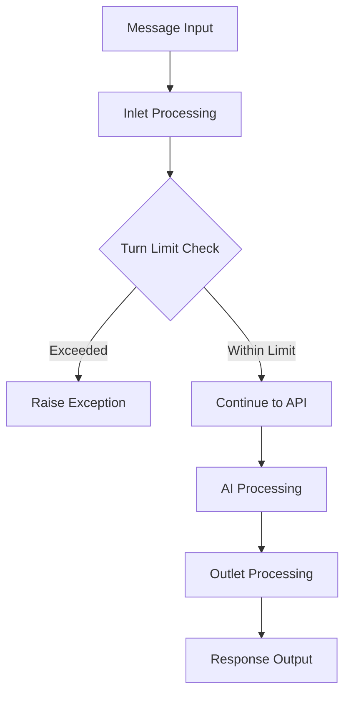

# 🔄 Max Turns Filter

> **Intelligent conversation length management with role-based limits and per-user customization**

[](https://github.com/open-webui/functions)
[](https://github.com/open-webui/open-webui)
[](LICENSE)
[](https://www.python.org)

---

## 🌟 Overview

**Max Turns Filter** is a comprehensive OpenWebUI filter that automatically manages conversation length by enforcing configurable turn limits. This filter prevents excessively long conversations while providing flexible role-based controls and per-user customization options to optimize AI interactions and resource usage.

### ✨ Key Features

- 🔢 **Turn-Based Limiting** - Counts user-assistant exchange pairs as conversation turns
- 👥 **Role-Based Controls** - Separate limits for admin and regular users
- 🎛️ **Per-User Customization** - Individual user limits via UserValves
- 🛡️ **Admin Override** - Optional admin exemption from turn limits
- ⚡ **Real-Time Enforcement** - Immediate blocking when limits exceeded
- 🔍 **Debug Monitoring** - Comprehensive logging of filter operations
- 📊 **Dual Processing** - Both inlet and outlet processing capabilities
- ⚙️ **Flexible Configuration** - Customizable limits and behaviors

---

## 📋 Table of Contents

- [🚀 Quick Start](#-quick-start)
- [🏗️ Installation](#️-installation)
- [🎯 Core Concepts](#-core-concepts)
  - [Filter Architecture](#filter-architecture)
  - [Turn Calculation](#turn-calculation)
  - [Role-Based Limits](#role-based-limits)
- [🛠️ Configuration](#️-configuration)
  - [Global Settings](#global-settings)
  - [User-Specific Settings](#user-specific-settings)
  - [Admin Controls](#admin-controls)
- [💡 Usage Guide](#-usage-guide)
  - [Basic Operation](#basic-operation)
  - [Turn Counting](#turn-counting)
  - [Limit Enforcement](#limit-enforcement)
- [🏗️ System Architecture](#️-system-architecture)
  - [Processing Pipeline](#processing-pipeline)
  - [Exception Handling](#exception-handling)
  - [Debug System](#debug-system)
- [🔧 Troubleshooting](#-troubleshooting)
- [🚀 Advanced Features](#-advanced-features)
- [🤝 Contributing](#-contributing)

---

## 🚀 Quick Start

### 1️⃣ Install the Filter
1. Copy the complete filter code
2. Add as a new filter in OpenWebUI
3. Configure turn limits for users and admins
4. Enable the filter for conversation management

### 2️⃣ Set Turn Limits
- Configure `max_turns_for_users` (default: 8)
- Configure `max_turns_for_admins` (default: 8)
- Adjust `enabled_for_admins` based on admin policy

### 3️⃣ Customize Per-User Limits
- Set individual `max_turns` in UserValves (default: 4)
- Override global settings for specific users
- Fine-tune based on user needs and roles

### 4️⃣ Monitor Conversations
- Watch for automatic limit enforcement
- Review debug logs for turn counting
- Adjust limits based on usage patterns

---

## 🏗️ Installation

### Prerequisites
- OpenWebUI instance with filter support
- Administrator access to add filters
- Understanding of conversation turn dynamics
- Access to user management for UserValves configuration

### Step-by-Step Installation

1. **Access Filter Management**
   - Navigate to OpenWebUI Settings
   - Go to Admin Panel → Filters
   - Click "Add Filter"

2. **Install Max Turns Filter**
   - Copy the complete filter code
   - Paste into the filter editor
   - Set filter name: "Max Turns Filter"
   - Save and enable the filter

3. **Configure Global Limits**
   - Set `max_turns_for_users` (recommended: 8-12)
   - Set `max_turns_for_admins` (recommended: 12-20)
   - Configure `enabled_for_admins` (default: true)
   - Adjust `priority` if using multiple filters

4. **Set User-Specific Limits**
   - Configure UserValves for individual users
   - Set `max_turns` per user as needed
   - Consider user roles and use cases

5. **Test Enforcement**
   - Start conversations and reach turn limits
   - Verify exceptions are raised appropriately
   - Check debug output for proper operation

---

## 🎯 Core Concepts

### Filter Architecture

The **Max Turns Filter** implements both inlet and outlet processing with comprehensive turn management:

#### 🏗️ Component Structure
```python
class Filter:
    class Valves(BaseModel):
        priority: int = 0                    # Filter execution order
        max_turns_for_users: int = 8         # Regular user turn limit
        max_turns_for_admins: int = 8        # Admin user turn limit
        enabled_for_admins: bool = True      # Admin enforcement toggle
    
    class UserValves(BaseModel):
        max_turns: int = 4                   # Per-user turn limit
    
    def inlet(self, body, __user__):         # Pre-processing
    def outlet(self, body, __user__):        # Post-processing
```

#### 🔧 Core Components
- **Global Valves** - System-wide turn limit configuration
- **UserValves** - Individual user customization
- **Turn Calculator** - Counts user-assistant exchange pairs
- **Role Detector** - Identifies admin vs regular users
- **Exception Handler** - Enforces limits with clear error messages
- **Debug Logger** - Comprehensive operation monitoring

### Turn Calculation

The filter implements intelligent turn counting based on message pairs:

#### 🔢 Turn Counting Logic
```python
current_turns = len(messages) // 2
# Each turn = User Message + Assistant Response
# Example: [User1, AI1, User2, AI2] = 2 turns
```

#### 📊 Turn Calculation Examples
| Messages | Content | Turn Count |
|----------|---------|------------|
| `[User1]` | Single user message | `0` turns |
| `[User1, AI1]` | One complete exchange | `1` turn |
| `[User1, AI1, User2]` | One turn + new user message | `1` turn |
| `[User1, AI1, User2, AI2]` | Two complete exchanges | `2` turns |
| `[System, User1, AI1, User2, AI2]` | System + 2 turns | `2` turns |

#### 🎯 Counting Considerations
- **System Messages** - Don't count toward turn limits
- **Incomplete Turns** - Partial exchanges count as previous turn
- **Message Types** - Only user-assistant pairs counted
- **Integer Division** - Uses `//` to ensure whole turn counting

### Role-Based Limits

#### 👥 User Role Management
The filter provides sophisticated role-based limit enforcement:

| User Type | Limit Source | Override Available |
|-----------|--------------|-------------------|
| **Regular User** | `max_turns_for_users` | Via UserValves |
| **Admin User** | `max_turns_for_admins` | Via `enabled_for_admins` |
| **Admin (Disabled)** | `float("inf")` | Unlimited turns |

#### 🛡️ Admin Control Logic
```python
if __user__.get("role") == "admin" and not self.valves.enabled_for_admins:
    max_turns = float("inf")  # Unlimited for admins
else:
    max_turns = (
        self.valves.max_turns_for_admins if __user__.get("role") == "admin"
        else self.valves.max_turns_for_users
    )
```

---

## 🛠️ Configuration

### Global Settings

#### 🎛️ Core Configuration
| Setting | Default | Description | Recommended Range |
|---------|---------|-------------|-------------------|
| `max_turns_for_users` | `8` | Regular user turn limit | `4-15` |
| `max_turns_for_admins` | `8` | Admin user turn limit | `10-25` |
| `enabled_for_admins` | `true` | Apply limits to admins | `true`/`false` |
| `priority` | `0` | Filter execution order | `-10` to `10` |

#### 📊 Turn Limit Guidelines
| Use Case | Users | Admins | Reasoning |
|----------|-------|--------|-----------|
| **Resource Limited** | `4-6` | `8-10` | Minimize compute usage |
| **General Purpose** | `8-12` | `15-20` | Balance utility and limits |
| **Research/Development** | `15-20` | `25-30` | Extended conversation needs |
| **No Limits** | `50+` | `disabled` | Maximum flexibility |

### User-Specific Settings

#### 👤 UserValves Configuration
```python
class UserValves(BaseModel):
    max_turns: int = Field(default=4, description="Maximum allowable conversation turns for a user.")
```

#### 🎯 UserValves Use Cases
```python
# Power user with higher limits
user_valves = {"max_turns": 15}

# Restricted user with lower limits  
user_valves = {"max_turns": 2}

# Testing user with single turn
user_valves = {"max_turns": 1}

# Default user (inherits global settings)
user_valves = {"max_turns": 4}
```

### Admin Controls

#### 🔧 Admin Configuration Scenarios
```python
# Scenario 1: Admins have higher limits (default)
max_turns_for_users = 8
max_turns_for_admins = 8
enabled_for_admins = True

# Scenario 2: Admins unlimited, users limited
max_turns_for_users = 6
max_turns_for_admins = 20  # Doesn't matter
enabled_for_admins = False  # Unlimited for admins

# Scenario 3: Equal limits for all
max_turns_for_users = 10
max_turns_for_admins = 10
enabled_for_admins = True

# Scenario 4: Strict limits for everyone
max_turns_for_users = 5
max_turns_for_admins = 5
enabled_for_admins = True
```

---

## 💡 Usage Guide

### Basic Operation

#### 🔄 Automatic Enforcement Process
1. **Message Received** - New user message enters pipeline
2. **Turn Calculation** - Count existing conversation turns
3. **Role Detection** - Identify user role (admin/regular)
4. **Limit Lookup** - Determine applicable turn limit
5. **Limit Check** - Compare current turns vs limit
6. **Action** - Allow continuation or raise exception

#### 📝 Example Conversation Flow
```
Turn 1: User: "Hello"          → AI: "Hi there!"
Turn 2: User: "How are you?"   → AI: "I'm doing well!"
Turn 3: User: "What's 2+2?"    → AI: "2+2 equals 4."
Turn 4: User: "Thanks!"        → AI: "You're welcome!"
...
Turn 8: User: "One more?"      → Exception: "Turn limit exceeded"
```

### Turn Counting

#### 🔢 Understanding Turn Mechanics

**Complete Turn Examples:**
```python
# 2 Turns
messages = [
    {"role": "user", "content": "Question 1"},
    {"role": "assistant", "content": "Answer 1"},
    {"role": "user", "content": "Question 2"},
    {"role": "assistant", "content": "Answer 2"}
]
# current_turns = 4 // 2 = 2
```

**Incomplete Turn Examples:**
```python
# Still 2 Turns (new user message doesn't count until AI responds)
messages = [
    {"role": "user", "content": "Question 1"},
    {"role": "assistant", "content": "Answer 1"},
    {"role": "user", "content": "Question 2"},
    {"role": "assistant", "content": "Answer 2"},
    {"role": "user", "content": "Question 3"}  # No AI response yet
]
# current_turns = 5 // 2 = 2
```

### Limit Enforcement

#### ⚡ Exception-Based Blocking
When limits are exceeded, the filter raises a descriptive exception:

```python
raise Exception(
    f"Conversation turn limit exceeded. The maximum turns allowed is {max_turns}."
)
```

#### 🎯 Exception Scenarios
| Situation | Exception Message | User Experience |
|-----------|------------------|-----------------|
| **User Limit Reached** | "...maximum turns allowed is 8." | Conversation blocked |
| **Admin Limit Reached** | "...maximum turns allowed is 12." | Conversation blocked |
| **Admin Unlimited** | No exception | Conversation continues |

---

## 🏗️ System Architecture

### Processing Pipeline

#### 🔄 Dual Processing Model


#### 📊 Inlet vs Outlet Processing
| Phase | Purpose | Operations |
|-------|---------|------------|
| **Inlet** | Pre-processing | Turn counting, limit checking, exception raising |
| **Outlet** | Post-processing | Response logging, analytics, debugging |

### Exception Handling

#### ⚠️ Exception Flow
```python
def inlet(self, body: dict, __user__: Optional[dict] = None) -> dict:
    # Calculate turns and check limits
    if current_turns >= max_turns:
        raise Exception(f"Conversation turn limit exceeded. The maximum turns allowed is {max_turns}.")
    
    return body  # Continue processing if within limits
```

#### 🛡️ Exception Benefits
- **Immediate Feedback** - Users know exactly why conversation stopped
- **Resource Protection** - Prevents excessive API usage
- **Clear Messaging** - Explains the specific limit that was exceeded
- **Graceful Handling** - OpenWebUI displays exception as user-friendly error

### Debug System

#### 🔍 Comprehensive Logging
```python
print(f"inlet:{__name__}")           # Filter identification
print(f"inlet:body:{body}")          # Full request body
print(f"inlet:user:{__user__}")      # User context information

print(f"outlet:{__name__}")          # Filter identification  
print(f"outlet:body:{body}")         # Full response body
print(f"outlet:user:{__user__}")     # User context information
```

#### 📊 Debug Information Captured
- **Filter Identity** - Which filter is processing
- **Request/Response Bodies** - Complete message data
- **User Context** - Role, permissions, user-specific settings
- **Processing Phase** - Inlet vs outlet operations

---

## 🔧 Troubleshooting

### Common Issues

#### ❌ Premature Turn Limit Reached
**Problem**: Filter blocks conversations earlier than expected
```
Solution: Check turn calculation logic
1. Verify message counting: len(messages) // 2
2. Check for system messages affecting count
3. Confirm user role detection is correct
4. Review UserValves overrides
5. Test with debug output enabled
```

#### ❌ Admin Limits Not Working
**Problem**: Admins still hit limits when they shouldn't
```
Solution: Check admin configuration
1. Verify enabled_for_admins setting
2. Confirm user role is "admin" in system
3. Check UserValves don't override admin settings
4. Test with admin account directly
5. Review debug logs for role detection
```

#### ❌ UserValves Not Applied
**Problem**: Per-user limits not taking effect
```
Solution: Verify UserValves configuration
1. Check UserValves are properly set in user profile
2. Confirm UserValves override global settings
3. Verify user identification is correct
4. Test with specific user accounts
5. Check for syntax errors in UserValves
```

#### ❌ Inconsistent Turn Counting
**Problem**: Turn count seems incorrect or inconsistent
```
Solution: Debug turn calculation
1. Enable debug output to see message arrays
2. Check for non-standard message formats
3. Verify system messages aren't affecting count
4. Test with known message sequences
5. Review message role assignments
```

### Debug Mode

#### 🐛 Enhanced Debug Output
```python
def inlet(self, body: dict, __user__: Optional[dict] = None) -> dict:
    print(f"=== MAX TURNS FILTER DEBUG ===")
    
    messages = body.get("messages", [])
    current_turns = len(messages) // 2
    user_role = __user__.get("role") if __user__ else "unknown"
    
    print(f"Message count: {len(messages)}")
    print(f"Calculated turns: {current_turns}")
    print(f"User role: {user_role}")
    
    # Determine applicable limit
    if __user__.get("role") == "admin" and not self.valves.enabled_for_admins:
        max_turns = float("inf")
        print(f"Admin unlimited mode: {max_turns}")
    else:
        max_turns = (
            self.valves.max_turns_for_admins if __user__.get("role") == "admin"
            else self.valves.max_turns_for_users
        )
        print(f"Applied limit: {max_turns}")
    
    print(f"Limit check: {current_turns} >= {max_turns} = {current_turns >= max_turns}")
    
    if current_turns >= max_turns:
        print(f"BLOCKING: Turn limit exceeded")
        raise Exception(f"Conversation turn limit exceeded. The maximum turns allowed is {max_turns}.")
    
    print(f"ALLOWING: Within turn limit")
    return body
```

---

## 🚀 Advanced Features

### Dynamic Limit Adjustment

#### 📊 Context-Aware Limits
```python
class Valves(BaseModel):
    # ... existing fields ...
    adjust_for_complexity: bool = Field(default=False, description="Adjust limits based on conversation complexity")
    complex_conversation_bonus: int = Field(default=5, description="Extra turns for complex conversations")

def detect_complex_conversation(self, messages: list) -> bool:
    # Analyze conversation for complexity indicators
    content = " ".join([msg.get("content", "") for msg in messages])
    complexity_keywords = ["analyze", "explain", "research", "detailed", "comprehensive"]
    
    return any(keyword in content.lower() for keyword in complexity_keywords)

def calculate_dynamic_limit(self, base_limit: int, messages: list) -> int:
    if self.valves.adjust_for_complexity and self.detect_complex_conversation(messages):
        return base_limit + self.valves.complex_conversation_bonus
    return base_limit
```

#### 🎯 User Behavior Analysis
```python
def analyze_user_patterns(self, user_id: str) -> dict:
    # Track user conversation patterns
    patterns = {
        "average_turns": self.get_user_average_turns(user_id),
        "conversation_frequency": self.get_conversation_frequency(user_id),
        "topic_complexity": self.get_topic_complexity_score(user_id)
    }
    
    return patterns

def recommend_turn_limit(self, user_id: str) -> int:
    patterns = self.analyze_user_patterns(user_id)
    
    if patterns["topic_complexity"] > 0.8:
        return self.valves.max_turns_for_users + 5
    elif patterns["average_turns"] < 3:
        return self.valves.max_turns_for_users - 2
    else:
        return self.valves.max_turns_for_users
```

### Integration Patterns

#### 🔗 Multi-Filter Coordination
```python
class Valves(BaseModel):
    # ... existing fields ...
    coordinate_with_context_filter: bool = Field(default=True)
    respect_priority_users: bool = Field(default=True)

def should_apply_limits(self, __user__: dict, body: dict) -> bool:
    # Check for priority user flags
    if self.valves.respect_priority_users:
        user_flags = __user__.get("flags", [])
        if "priority_user" in user_flags:
            return False
    
    # Check for special conversation types
    messages = body.get("messages", [])
    if any("EMERGENCY:" in msg.get("content", "") for msg in messages):
        return False
    
    return True
```

#### 📊 Usage Analytics
```python
class TurnUsageTracker:
    def __init__(self):
        self.usage_stats = {}
    
    def log_turn_usage(self, user_id: str, turns_used: int, limit_hit: bool):
        if user_id not in self.usage_stats:
            self.usage_stats[user_id] = {
                "total_conversations": 0,
                "average_turns": 0,
                "limit_hits": 0
            }
        
        stats = self.usage_stats[user_id]
        stats["total_conversations"] += 1
        
        # Update rolling average
        current_avg = stats["average_turns"]
        total_convs = stats["total_conversations"]
        stats["average_turns"] = ((current_avg * (total_convs - 1)) + turns_used) / total_convs
        
        if limit_hit:
            stats["limit_hits"] += 1
    
    def get_optimization_suggestions(self, user_id: str) -> dict:
        if user_id not in self.usage_stats:
            return {"suggestion": "insufficient_data"}
        
        stats = self.usage_stats[user_id]
        hit_rate = stats["limit_hits"] / stats["total_conversations"]
        
        if hit_rate > 0.5:
            return {"suggestion": "increase_limit", "recommended_increase": 5}
        elif hit_rate < 0.1 and stats["average_turns"] < 4:
            return {"suggestion": "decrease_limit", "recommended_decrease": 2}
        else:
            return {"suggestion": "maintain_current"}
```

### Performance Optimization

#### ⚡ Efficient Processing
```python
def inlet(self, body: dict, __user__: Optional[dict] = None) -> dict:
    # Early exit for unlimited users
    if __user__ and self.is_unlimited_user(__user__):
        return body
    
    # Cache turn calculations
    messages = body.get("messages", [])
    message_count = len(messages)
    
    # Only calculate if we're close to limits
    if message_count < 6:  # Less than 3 turns, no need to check
        return body
    
    current_turns = message_count // 2
    max_turns = self.get_user_limit(__user__)
    
    if current_turns >= max_turns:
        raise Exception(f"Conversation turn limit exceeded. The maximum turns allowed is {max_turns}.")
    
    return body

def is_unlimited_user(self, user: dict) -> bool:
    return (user.get("role") == "admin" and not self.valves.enabled_for_admins)

def get_user_limit(self, user: dict) -> int:
    if user.get("role") == "admin":
        return self.valves.max_turns_for_admins
    else:
        return self.valves.max_turns_for_users
```

---

## 🤝 Contributing

### Development Setup

#### 🛠️ Local Development
1. **Clone Repository** - Set up local OpenWebUI development environment
2. **Install Dependencies** - Ensure pydantic is available
3. **Test Changes** - Use OpenWebUI development instance
4. **Submit PR** - Follow OpenWebUI contribution guidelines

### Filter Guidelines

#### 📝 Best Practices
- **Efficient Turn Counting** - Minimize computational overhead
- **Clear Exception Messages** - Provide actionable user feedback
- **Flexible Configuration** - Support various use cases and limits
- **Robust Role Detection** - Handle admin/user scenarios correctly
- **Comprehensive Logging** - Enable effective debugging

#### 🧪 Testing Requirements
- **Turn Calculation Accuracy** - Verify counting logic with various message patterns
- **Role-Based Behavior** - Test admin and user limit enforcement
- **UserValves Integration** - Confirm per-user customization works
- **Exception Handling** - Ensure graceful limit enforcement
- **Performance Impact** - Minimize processing overhead

### Feature Requests

#### 💡 Enhancement Ideas
- **Conversation Context Analysis** - Smart limits based on topic complexity
- **Usage Pattern Learning** - Adaptive limits based on user behavior
- **Grace Period System** - Warning before hard limits
- **Conversation Archiving** - Save conversations when limits reached
- **Advanced Analytics** - Detailed usage statistics and optimization

---

## 📄 License

This project is licensed under the MIT License - see the [LICENSE](LICENSE) file for details.

---

## 🙏 Acknowledgments

- **OpenWebUI Team** - For the comprehensive filter system architecture
- **Community Contributors** - For feedback on conversation management needs
- **Beta Testers** - For real-world usage testing and optimization suggestions

---

## 📞 Support

- **GitHub Issues** - [Report bugs and request features](https://github.com/open-webui/functions/issues)
- **Discussions** - [Community support and questions](https://github.com/open-webui/functions/discussions)
- **Documentation** - [OpenWebUI Filters Documentation](https://docs.openwebui.com)

---

<div align="center">

**🔄 Optimize your AI conversations with intelligent turn management!**

*Smart limits • Role-based controls • Per-user customization*

</div>