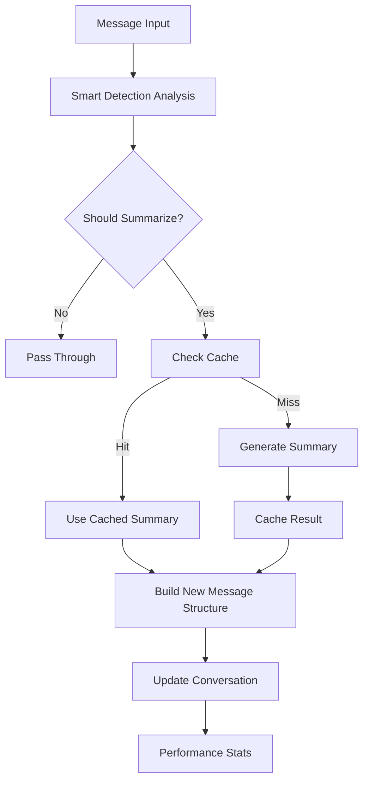

# 📝 Enhanced Conversation Summarizer

> **Intelligent conversation management for Open WebUI with advanced summarization capabilities**

[](https://github.com/open-webui/functions)
[](https://github.com/open-webui/open-webui)
[](LICENSE)

---

## 🌟 Overview

**Enhanced Conversation Summarizer** is a powerful Open WebUI filter that automatically manages long conversations by intelligently summarizing older messages while preserving recent context. Built with smart detection, model selection, and performance optimization, it ensures your conversations remain focused and within context limits without losing important information.

### ✨ Key Features

- 🧠 **Smart Conversation Analysis** - Intelligent detection of conversation complexity, technical content, and context
- 🎛️ **Model Selection** - Choose specific models for summarization or use current conversation model
- ⚡ **Performance Optimized** - Smart caching, adaptive thresholds, and efficient processing
- 🎯 **Quality Modes** - Quick, Balanced, or Detailed summarization based on your needs
- 📊 **Advanced Detection** - Mid-conversation loading awareness and existing summary recognition
- 🔧 **Comprehensive Configuration** - 15+ customizable settings for fine-tuned control
- 🐛 **Debug & Monitoring** - Extensive logging and performance statistics
- 💾 **Reliable Operation** - Graceful error handling and fallback mechanisms

---

## 🚨 Important: Getting Started

> **⚠️ RECOMMENDED:** Enable debug mode during initial setup to monitor filter operation and fine-tune settings. The filter works immediately after installation but can be optimized for your specific use case.

---

## 📋 Table of Contents

- [🚀 Quick Start](#-quick-start)
- [🏗️ Installation](#️-installation)
- [🎯 Core Concepts](#-core-concepts)
  - [Smart Detection System](#smart-detection-system)
  - [Quality Modes](#quality-modes)
  - [Model Selection](#model-selection)
- [🛠️ Configuration](#️-configuration)
  - [Core Settings](#core-settings)
  - [Advanced Options](#advanced-options)
  - [Performance Tuning](#performance-tuning)
- [💡 Usage Guide](#-usage-guide)
  - [Basic Operation](#basic-operation)
  - [Testing & Debugging](#testing--debugging)
  - [Optimization Tips](#optimization-tips)
- [🏗️ System Architecture](#️-system-architecture)
  - [Processing Pipeline](#processing-pipeline)
  - [Caching System](#caching-system)
  - [Performance Monitoring](#performance-monitoring)
- [🔧 Troubleshooting](#-troubleshooting)
- [🚀 Advanced Features](#-advanced-features)
- [🤝 Contributing](#-contributing)

---

## 🚀 Quick Start

### 1️⃣ Install the Filter
1. Copy the complete filter code from the artifacts
2. Add as a new filter in Open WebUI (Admin Panel → Functions)
3. Enable the filter for your desired models or globally

### 2️⃣ Basic Configuration
```yaml
# Recommended starting settings
summary_trigger_turns: 8        # Trigger after 8 conversation turns
preserve_recent_turns: 4        # Keep last 4 turns unsummarized  
summary_quality: "balanced"     # Use balanced quality mode
summary_model: "auto"          # Use current conversation model
enable_debug: true             # Enable debugging initially
```

### 3️⃣ Test the System
1. Start a conversation with 8+ back-and-forth messages
2. Watch for status messages indicating summarization
3. Check console logs for detailed operation info
4. Use `force_summarize_next: true` for manual testing

### 4️⃣ Monitor & Optimize
- Review debug logs to understand trigger patterns
- Adjust `summary_trigger_turns` based on your needs
- Experiment with different `summary_quality` modes
- Fine-tune `adaptive_threshold` settings

---

## 🏗️ Installation

### Prerequisites
- Open WebUI instance with filter support
- Administrator access to add filters
- Models available for conversation and summarization

### Step-by-Step Installation

1. **Access Filter Management**
   - Navigate to Open WebUI Admin Panel
   - Go to Workspace → Functions
   - Click "Add Function" or import option

2. **Install Conversation Summarizer**
   - Copy the complete filter code
   - Paste into the function editor
   - Set function name: "Enhanced Conversation Summarizer"
   - Save and enable the function

3. **Configure Filter Assignment**
   - Go to Workspace → Models
   - Assign the filter to specific models, or
   - Enable globally via Workspace → Functions (Global toggle)

4. **Initial Configuration**
   - Review valve settings in the function configuration
   - Enable `enable_debug: true` for initial testing
   - Set `test_mode: true` for extra status messages
   - Configure `summary_model` if using different model for summarization

5. **Verification**
   - Start a test conversation
   - Send 8+ messages back and forth
   - Watch for summarization status messages
   - Check console logs for debug information

---

## 🎯 Core Concepts

### Smart Detection System

The **Smart Detection System** provides intelligent conversation analysis:

#### 🧠 What It Analyzes
- **Conversation Complexity**: Technical terms, code blocks, detailed explanations
- **Message Quality**: Filters out very short messages, focuses on substantial content
- **Existing Summaries**: Detects previous summaries to avoid redundant processing
- **Recent Activity**: Weighs recent conversation engagement levels
- **Question Patterns**: Identifies Q&A sessions and help requests

#### 🔄 How It Works
- **Complexity Scoring**: Calculates conversation difficulty based on content analysis
- **Adaptive Thresholds**: Adjusts trigger points based on conversation complexity
- **Context Preservation**: Maintains important details, numbers, dates, and decisions
- **Smart Timing**: Uses sophisticated logic to determine optimal summarization moments

### Quality Modes

Choose the right summarization approach for your needs:

| Mode | Speed | Detail | Use Case |
|------|-------|--------|----------|
| **Quick** | ⚡ Fast | 📄 Basic | Simple conversations, fast processing |
| **Balanced** | ⚖️ Medium | 📊 Good | General use, optimal balance |
| **Detailed** | 🐌 Slower | 📚 Rich | Complex technical discussions, comprehensive context |

#### 📋 Quality Mode Features
- **Quick**: Main topics, basic context, ~250 characters
- **Balanced**: Key questions, technical terms, important details, ~500 characters  
- **Detailed**: Comprehensive coverage, decisions, full technical context, ~800 characters

### Model Selection

#### 🎛️ Model Configuration Options
```yaml
summary_model: "auto"              # Use current conversation model
summary_model: "llama3.2:3b"      # Use specific lightweight model
summary_model: "qwen2.5:1.5b"     # Use fast, efficient model
summary_model: "gpt-3.5-turbo"    # Use cloud model for summarization
```

#### 💡 Model Selection Benefits
- **Performance**: Use faster models for background summarization
- **Cost Efficiency**: Use cheaper models for the summarization task
- **Specialization**: Some models excel at summarization vs conversation
- **Resource Management**: Distribute computational load

---

## 🛠️ Configuration

### Core Settings

#### 🎛️ Essential Configuration
| Setting | Default | Description |
|---------|---------|-------------|
| `summary_trigger_turns` | `8` | Number of conversation turns that triggers summarization |
| `preserve_recent_turns` | `4` | Number of recent turns to keep unsummarized |
| `summary_model` | `"auto"` | Model for summarization (`"auto"` or specific model name) |
| `summary_quality` | `"balanced"` | Summary quality: `"quick"`, `"balanced"`, or `"detailed"` |
| `priority` | `0` | Filter execution priority (lower = higher priority) |

#### 🧠 Intelligence Settings
| Setting | Default | Description |
|---------|---------|-------------|
| `smart_detection` | `true` | Enable intelligent conversation analysis |
| `adaptive_threshold` | `true` | Adjust trigger based on message complexity |
| `preserve_important_details` | `true` | Extract and preserve numbers, dates, key facts |
| `include_context_hints` | `true` | Add helpful context hints to summaries |
| `min_message_length` | `20` | Minimum characters per message to count |

### Advanced Options

#### ⚡ Performance Settings
```yaml
enable_caching: true                    # Cache summaries for performance
enable_ai_summarization: false         # Future AI-based summarization (experimental)
debug_performance: false               # Enable performance timing logs
```

#### 🔧 Testing & Debug
```yaml
enable_debug: true                     # Enable comprehensive debug logging
test_mode: true                        # Extra status messages for testing
force_summarize_next: false           # Force summarization on next message
```

### Performance Tuning

#### 🚀 Optimization Features
- **Smart Caching** - Avoids regenerating identical summaries
- **Adaptive Thresholds** - Complex conversations get summarized sooner
- **Efficient Processing** - Only processes meaningful messages
- **Change Detection** - Monitors conversation patterns for optimal timing

#### 📊 Performance Monitoring
The filter tracks and reports:
- Cache hit ratios for efficiency measurement
- Summary creation statistics
- Processing time for optimization
- Pattern matching performance

---

## 💡 Usage Guide

### Basic Operation

#### 🔄 Automatic Operation
The filter works transparently:
1. **Monitors** conversation length and complexity
2. **Triggers** summarization when thresholds are met
3. **Preserves** recent messages for natural flow
4. **Creates** intelligent summaries with key context
5. **Continues** conversation seamlessly

#### 📊 Status Messages
Watch for these indicators:
```
🔍 Summarizer analyzing 12 messages...
📝 Creating balanced summary using current model (10 turns → summary + 4 recent)
✅ Enhanced summary created! 12 → 6 messages
```

### Testing & Debugging

#### 🧪 Manual Testing
1. **Enable Test Mode**
   ```yaml
   test_mode: true
   enable_debug: true
   ```

2. **Force Summarization**
   ```yaml
   force_summarize_next: true
   ```

3. **Monitor Console**
   - Check browser developer tools console
   - Look for detailed debug messages
   - Watch performance statistics

#### 🐛 Debug Information
Debug logs show:
```
=== CONV_SUMMARIZER DEBUG ===
[14:30:22] Total messages: 12
[14:30:22] Conversation analysis - Total: 8, Valid: 7, Complexity: 1.85
[14:30:22] Should summarize: true (smart: true, force: false)
[14:30:22] Generated enhanced rule-based balanced summary
=============================
```

### Optimization Tips

#### ⚙️ Fine-Tuning Settings
- **Lower Trigger**: Reduce `summary_trigger_turns` for shorter conversations
- **Preserve More**: Increase `preserve_recent_turns` for better context
- **Quality Adjustment**: Use `"detailed"` for technical discussions
- **Model Selection**: Use lightweight models for summarization

#### 📈 Performance Optimization
- **Enable Caching**: Keep `enable_caching: true` for repeated patterns
- **Adaptive Thresholds**: Use `adaptive_threshold: true` for smart timing
- **Smart Detection**: Keep `smart_detection: true` for best results

---

## 🏗️ System Architecture

### Processing Pipeline

#### 🔄 Conversation Analysis Flow


#### 🧠 Smart Detection Process
1. **Message Analysis** - Count valid turns, analyze complexity
2. **Context Detection** - Check for existing summaries, technical content
3. **Threshold Calculation** - Apply adaptive logic based on complexity
4. **Decision Logic** - Determine if summarization should occur
5. **Summary Generation** - Create quality-appropriate summary
6. **Context Integration** - Seamlessly integrate into conversation flow

### Caching System

#### 🗄️ Intelligent Caching Features
- **Content-Based Keys** - Hash message content for cache identification
- **Cache Size Management** - Automatic cleanup, keeps 15 most recent
- **Hit Rate Monitoring** - Track cache effectiveness
- **Performance Benefits** - Avoid regenerating identical summaries

#### ⚡ Cache Performance
```python
# Cache statistics tracking
{
    "cache_hits": 15,
    "summaries_created": 8,
    "hit_ratio": 0.65
}
```

### Performance Monitoring

#### 📊 Built-in Metrics
- **Conversation Processing Time** - How long analysis takes
- **Summary Generation Time** - Time to create summaries
- **Cache Performance** - Hit ratios and efficiency
- **Memory Usage** - Tracking cache size and cleanup

---

## 🔧 Troubleshooting

### Common Issues

#### ❌ Filter Not Triggering
**Problem**: Conversations don't get summarized
```yaml
# Solutions to try:
1. Check filter is enabled for your model
2. Verify summary_trigger_turns setting (default: 8)
3. Enable debug mode: enable_debug: true
4. Test manually: force_summarize_next: true
5. Check console logs for error messages
```

#### ❌ Poor Summary Quality
**Problem**: Summaries miss important context
```yaml
# Improvements:
1. Change quality mode: summary_quality: "detailed"
2. Enable detail preservation: preserve_important_details: true
3. Increase context: preserve_recent_turns: 6
4. Use specialized model: summary_model: "specific-model"
```

#### ❌ Performance Issues
**Problem**: Filter causes delays or errors
```yaml
# Optimizations:
1. Enable caching: enable_caching: true
2. Use lightweight model: summary_model: "llama3.2:3b"
3. Reduce detail level: summary_quality: "quick"
4. Check debug logs for bottlenecks
```

### Debug Mode

#### 🐛 Comprehensive Debugging
Enable full debugging:
```yaml
enable_debug: true
test_mode: true
debug_performance: true  # If available
```

#### 📋 Debug Output Interpretation
```bash
# Successful operation
[14:30:22] Enhanced analysis: {'total_turns': 8, 'complexity_score': 1.85}
[14:30:22] Should summarize: true
[14:30:22] Generated enhanced rule-based balanced summary

# Cache performance
[14:30:22] Performance stats: {'cache_hits': 5, 'summaries_created': 3}

# Error conditions
[14:30:22] ERROR: Filter error: [specific error message]
```

### Recovery Procedures

#### 🔄 Reset Filter State
1. **Toggle Filter**: Disable and re-enable in Open WebUI
2. **Clear Settings**: Reset valve configurations to defaults
3. **Restart Session**: Start a fresh conversation
4. **Check Logs**: Review console for persistent issues

#### 💾 Configuration Recovery
```yaml
# Safe default configuration
summary_trigger_turns: 8
preserve_recent_turns: 4
summary_quality: "balanced"
summary_model: "auto"
smart_detection: true
adaptive_threshold: true
enable_caching: true
enable_debug: true
```

---

## 🚀 Advanced Features

### Custom Quality Modes

#### 🎨 Summary Customization
The system extracts and preserves:
- **Questions Asked** - Key queries from users
- **Technical Terms** - Code blocks, programming languages, databases
- **Important Details** - Numbers, dates, years, measurements
- **Key Decisions** - Conclusions, solutions, outcomes
- **Topic Context** - Main discussion themes

### Performance Analytics

#### 📊 Built-in Statistics
Monitor filter performance:
```python
performance_stats = {
    "cache_hits": 15,        # Number of cache hits
    "summaries_created": 8,   # New summaries generated
    "hit_ratio": 0.65        # Cache efficiency
}
```

### Integration Patterns

#### 🔗 Workflow Integration
- **Development Teams** - Technical conversation management
- **Support Tickets** - Long troubleshooting session summaries
- **Research Projects** - Academic discussion preservation
- **Training Sessions** - Educational content summarization

### Future Enhancements

#### 🚀 Planned Features
- **AI-Based Summarization** - Direct model integration for summarization
- **Custom Prompt Templates** - User-defined summary formats
- **Multi-Language Support** - International conversation handling
- **Advanced Analytics** - Detailed conversation insights

---

## 🤝 Contributing

### Development Setup

#### 🛠️ Local Development
1. **Fork Repository** - Create your own copy
2. **Test Environment** - Set up Open WebUI instance
3. **Debug Mode** - Enable comprehensive logging
4. **Test Scenarios** - Create various conversation types

### Enhancement Contributions

#### 📝 Contribution Guidelines
- **Code Quality** - Follow existing patterns and style
- **Testing** - Ensure changes work across different scenarios
- **Documentation** - Update README for new features
- **Performance** - Maintain or improve processing efficiency

#### 🧪 Testing Requirements
- **Basic Functionality** - Verify summarization works
- **Edge Cases** - Test with various conversation types
- **Performance** - Ensure no significant slowdown
- **Error Handling** - Graceful failure scenarios

### Bug Reports

#### 🐛 Reporting Issues
Include the following information:
- **Open WebUI Version** - Your Open WebUI version
- **Filter Configuration** - Complete valve settings
- **Console Logs** - Full debug output
- **Conversation Example** - Sample conversation that caused issues
- **Expected vs Actual** - What should happen vs what does happen

---

## 📄 License

This project is licensed under the MIT License - see the [LICENSE](LICENSE) file for details.

---

## 🙏 Acknowledgments

- **Open WebUI Team** - For the incredible platform and filter system
- **Community Contributors** - For testing, feedback, and improvements
- **Beta Testers** - For early adoption and bug reports

---

## 📞 Support

- **GitHub Issues** - [Report bugs and request features](https://github.com/open-webui/functions/issues)
- **Discussions** - [Community support and questions](https://github.com/open-webui/functions/discussions)
- **Documentation** - This README and inline code documentation

---

<div align="center">

**📝 Enhance your Open WebUI conversations with intelligent summarization!**

*Smart detection • Model selection • Performance optimized • Production ready*

---

### 🔧 Configuration Quick Reference

| Setting | Default | Purpose |
|---------|---------|---------|
| `summary_trigger_turns` | `8` | When to start summarizing |
| `preserve_recent_turns` | `4` | Recent messages to keep |
| `summary_quality` | `"balanced"` | Summary detail level |
| `summary_model` | `"auto"` | Model for summarization |
| `smart_detection` | `true` | Intelligent analysis |
| `adaptive_threshold` | `true` | Dynamic triggering |
| `enable_debug` | `true` | Debug logging |

</div>