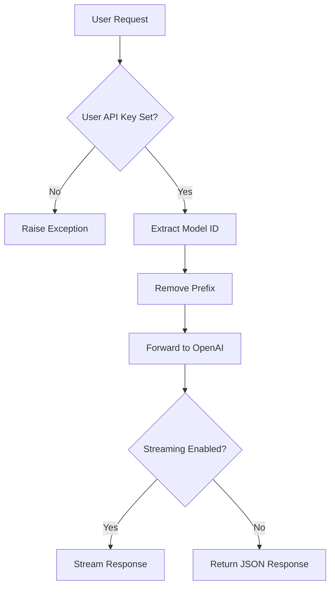

# 🤖 OpenAI Manifold Pipe

> **Seamless integration between OpenWebUI and OpenAI's GPT models with per-user API key support**

[](https://github.com/open-webui/functions)
[](https://github.com/open-webui/open-webui)
[](LICENSE)
[](https://www.python.org)
[](https://platform.openai.com/docs)

---

## 🌟 Overview

**OpenAI Manifold Pipe** is a streamlined OpenWebUI pipe that enables direct integration with OpenAI's GPT models through their official API. This pipe provides flexible authentication options with both global and per-user API keys, automatic model discovery, and seamless request forwarding to OpenAI's endpoints.

### ✨ Key Features

- 🔗 **Direct API Integration** - Native connection to OpenAI's GPT models via official API
- 👥 **Per-User API Keys** - Individual user authentication through UserValves
- 🔍 **Automatic Model Discovery** - Dynamic GPT model detection and filtering
- 🌐 **Configurable Endpoints** - Support for custom OpenAI-compatible APIs
- 📡 **Streaming Support** - Real-time response streaming for immediate feedback
- 🎯 **GPT Model Filtering** - Automatic filtering to show only GPT models
- ⚙️ **Flexible Configuration** - Customizable name prefixes and base URLs
- 🛡️ **Error Handling** - Basic exception management with user feedback

---

## 📋 Table of Contents

- [🚀 Quick Start](#-quick-start)
- [🏗️ Installation](#️-installation)
- [🎯 Core Concepts](#-core-concepts)
  - [Manifold Architecture](#manifold-architecture)
  - [Authentication System](#authentication-system)
  - [Model Discovery](#model-discovery)
- [🛠️ Configuration](#️-configuration)
  - [Global Settings](#global-settings)
  - [User-Specific Settings](#user-specific-settings)
  - [Custom Endpoints](#custom-endpoints)
- [💡 Usage Guide](#-usage-guide)
  - [Basic Setup](#basic-setup)
  - [User Configuration](#user-configuration)
  - [Model Selection](#model-selection)
- [🏗️ System Architecture](#️-system-architecture)
  - [Request Processing](#request-processing)
  - [Response Handling](#response-handling)
  - [Error Management](#error-management)
- [🔧 Troubleshooting](#-troubleshooting)
- [🚀 Advanced Features](#-advanced-features)
- [🤝 Contributing](#-contributing)

---

## 🚀 Quick Start

### 1️⃣ Install the Pipe
1. Copy the complete pipe code
2. Add as a new pipe in OpenWebUI
3. Configure global API key for model discovery
4. Set up user-specific API keys

### 2️⃣ Configure Global Settings
- Set `OPENAI_API_KEY` in valves for model discovery
- Configure `NAME_PREFIX` (default: "OPENAI/")
- Set `OPENAI_API_BASE_URL` if using custom endpoint

### 3️⃣ Set User API Keys
- Each user configures their own `OPENAI_API_KEY` in UserValves
- Users can use their personal OpenAI credits
- Supports organization-specific API keys

### 4️⃣ Start Using GPT Models
- Select from automatically discovered GPT models
- Models appear with configured prefix (e.g., "OPENAI/gpt-4")
- Enable streaming for real-time responses

---

## 🏗️ Installation

### Prerequisites
- OpenWebUI instance with pipe support
- Valid OpenAI API key(s) with appropriate access
- Python environment with required dependencies
- Administrator access to add pipes

### Step-by-Step Installation

1. **Access Pipe Management**
   - Navigate to OpenWebUI Settings
   - Go to Admin Panel → Pipes
   - Click "Add Pipe"

2. **Install OpenAI Manifold Pipe**
   - Copy the complete pipe code
   - Paste into the pipe editor
   - Set pipe name: "OpenAI Manifold Pipe"
   - Save and enable the pipe

3. **Configure Global Settings**
   - **API Key**: Set `OPENAI_API_KEY` for model discovery
   - **Base URL**: Configure `OPENAI_API_BASE_URL` (default: `https://api.openai.com/v1`)
   - **Name Prefix**: Set `NAME_PREFIX` (default: "OPENAI/")

4. **User Configuration**
   - Users access their settings/valves
   - Each user sets their personal `OPENAI_API_KEY`
   - Users can use different API keys/organizations

5. **Verify Installation**
   - Check that GPT models appear in model list
   - Test with a simple conversation
   - Verify streaming functionality

---

## 🎯 Core Concepts

### Manifold Architecture

The **OpenAI Manifold Pipe** implements OpenWebUI's manifold pattern for external provider integration:

#### 🏗️ Component Structure
```python
class Pipe:
    def __init__(self):
        self.type = "manifold"           # Declares as manifold pipe
    
    def pipes(self) -> List[dict]:       # Model discovery
    def pipe(self, body: dict, __user__): # Request processing
```

#### 🔧 Core Components
- **Model Discovery Engine** - Automatic GPT model detection from OpenAI API
- **Dual Authentication** - Global and per-user API key support
- **Request Forwarder** - Direct request passing to OpenAI endpoints
- **GPT Filter** - Automatic filtering to show only GPT models
- **Streaming Manager** - Real-time response delivery support
- **Error Handler** - Basic exception management

### Authentication System

The pipe implements a dual-layer authentication system:

#### 🔑 Authentication Layers
| Layer | Purpose | Configuration | Usage |
|-------|---------|---------------|-------|
| **Global** | Model discovery | `Valves.OPENAI_API_KEY` | Admin sets for pipe functionality |
| **User** | Request processing | `UserValves.OPENAI_API_KEY` | Each user sets personal key |

#### 🛡️ Authentication Flow
```python
# Model Discovery (Global)
def pipes(self):
    if self.valves.OPENAI_API_KEY:  # Use global key
        headers = {"Authorization": f"Bearer {self.valves.OPENAI_API_KEY}"}
        # Fetch models from OpenAI API

# Request Processing (User)
def pipe(self, body: dict, __user__: dict):
    user_valves = __user__.get("valves")
    if not user_valves.OPENAI_API_KEY:  # Require user key
        raise Exception("OPENAI_API_KEY not provided by the user.")
    headers = {"Authorization": f"Bearer {user_valves.OPENAI_API_KEY}"}
    # Process request with user's key
```

### Model Discovery

The pipe implements intelligent model discovery with GPT filtering:

#### 🔍 Discovery Process
```python
def pipes(self):
    # 1. Check global API key
    if self.valves.OPENAI_API_KEY:
        # 2. Fetch from OpenAI API
        r = requests.get(f"{self.valves.OPENAI_API_BASE_URL}/models", headers=headers)
        models = r.json()
        
        # 3. Filter and format GPT models only
        return [
            {
                "id": model["id"],
                "name": f'{self.valves.NAME_PREFIX}{model["name"] if "name" in model else model["id"]}'
            }
            for model in models["data"]
            if "gpt" in model["id"]  # GPT models only
        ]
```

#### 📊 Model Filtering
| Model Type | Included | Example |
|------------|----------|---------|
| **GPT Models** | ✅ Yes | `gpt-4`, `gpt-3.5-turbo`, `gpt-4-turbo` |
| **DALL-E Models** | ❌ No | `dall-e-3`, `dall-e-2` |
| **Embedding Models** | ❌ No | `text-embedding-ada-002` |
| **Other Models** | ❌ No | `whisper-1`, `tts-1` |

---

## 🛠️ Configuration

### Global Settings

#### 🎛️ Core Configuration (Valves)
| Setting | Default | Description | Example |
|---------|---------|-------------|---------|
| `OPENAI_API_KEY` | `""` | Global API key for model discovery | `sk-proj-...` |
| `OPENAI_API_BASE_URL` | `https://api.openai.com/v1` | OpenAI API endpoint | Custom endpoint URL |
| `NAME_PREFIX` | `"OPENAI/"` | Prefix for model names | `"GPT/"`, `"OPENAI/"` |

#### 🔧 Configuration Examples
```python
# Standard OpenAI Configuration
OPENAI_API_KEY = "sk-proj-xxxxxxxxxxxxxxxxxxxx"
OPENAI_API_BASE_URL = "https://api.openai.com/v1"
NAME_PREFIX = "OPENAI/"

# Custom Endpoint Configuration
OPENAI_API_KEY = "custom-key"
OPENAI_API_BASE_URL = "https://my-openai-proxy.com/v1"
NAME_PREFIX = "CUSTOM/"

# Azure OpenAI Configuration
OPENAI_API_BASE_URL = "https://my-resource.openai.azure.com/openai/deployments/my-deployment/v1"
NAME_PREFIX = "AZURE/"
```

### User-Specific Settings

#### 👤 UserValves Configuration
```python
class UserValves(BaseModel):
    OPENAI_API_KEY: str = Field(
        default="",
        description="User-specific API key for accessing OpenAI services."
    )
```

#### 🎯 User Configuration Scenarios
```python
# Personal API Key
user_valves = {"OPENAI_API_KEY": "sk-proj-user-personal-key"}

# Organization API Key
user_valves = {"OPENAI_API_KEY": "sk-proj-org-shared-key"}

# Department-Specific Key
user_valves = {"OPENAI_API_KEY": "sk-proj-dept-research-key"}
```

### Custom Endpoints

#### 🌐 OpenAI-Compatible APIs
The pipe supports various OpenAI-compatible endpoints:

| Provider | Base URL | Notes |
|----------|----------|-------|
| **OpenAI** | `https://api.openai.com/v1` | Official OpenAI API |
| **Azure OpenAI** | `https://{resource}.openai.azure.com/...` | Microsoft Azure hosted |
| **OpenAI Proxy** | `https://proxy.example.com/v1` | Custom proxy services |
| **Local Models** | `http://localhost:8000/v1` | Local OpenAI-compatible servers |

#### ⚙️ Custom Endpoint Setup
```python
# Azure OpenAI Service
OPENAI_API_BASE_URL = "https://my-resource.openai.azure.com/openai/deployments/gpt-4/v1"

# Local Ollama with OpenAI compatibility
OPENAI_API_BASE_URL = "http://localhost:11434/v1"

# Custom OpenAI proxy
OPENAI_API_BASE_URL = "https://my-proxy.example.com/openai/v1"
```

---

## 💡 Usage Guide

### Basic Setup

#### 🔧 Administrator Setup
1. **Configure Global API Key**
   - Set `OPENAI_API_KEY` in pipe valves
   - This enables model discovery for all users
   - Use organization API key if available

2. **Set Model Prefix**
   - Configure `NAME_PREFIX` for model naming
   - Default: "OPENAI/" results in "OPENAI/gpt-4"
   - Customize for organization branding

3. **Configure Endpoint**
   - Set `OPENAI_API_BASE_URL` for custom endpoints
   - Default points to official OpenAI API
   - Modify for Azure OpenAI or proxy services

### User Configuration

#### 👤 User Setup Process
1. **Access User Settings**
   - Navigate to user profile/settings
   - Find pipe-specific valves/configuration
   - Locate OpenAI Manifold Pipe settings

2. **Set Personal API Key**
   ```
   OPENAI_API_KEY: sk-proj-your-personal-api-key-here
   ```

3. **Verify Configuration**
   - Return to chat interface
   - Confirm GPT models are available
   - Test with a simple conversation

#### 🎯 User Benefits
- **Personal Usage Tracking** - Individual API usage and billing
- **Organization Flexibility** - Different users can use different org keys
- **Access Control** - Users control their own API access
- **Security** - Personal keys remain with individual users

### Model Selection

#### 🤖 Available Models
Models automatically discovered from OpenAI API:

| Model | Capabilities | Use Cases |
|-------|-------------|-----------|
| **gpt-4** | Most capable, multimodal | Complex reasoning, analysis |
| **gpt-4-turbo** | Fast GPT-4 variant | Balanced performance |
| **gpt-3.5-turbo** | Fast and efficient | General conversations |
| **gpt-4o** | Optimized GPT-4 | Cost-effective intelligence |

#### 📋 Model Selection Example
```
Available in OpenWebUI:
- OPENAI/gpt-4
- OPENAI/gpt-4-turbo  
- OPENAI/gpt-3.5-turbo
- OPENAI/gpt-4o
```

---

## 🏗️ System Architecture

### Request Processing

#### 🔄 Processing Pipeline


#### 📨 Request Transformation
```python
def pipe(self, body: dict, __user__: dict):
    # 1. Validate user API key
    user_valves = __user__.get("valves")
    if not user_valves.OPENAI_API_KEY:
        raise Exception("OPENAI_API_KEY not provided by the user.")
    
    # 2. Extract model ID (remove prefix)
    model_id = body["model"][body["model"].find(".") + 1:]
    
    # 3. Create payload
    payload = {**body, "model": model_id}
    
    # 4. Forward to OpenAI
    r = requests.post(
        url=f"{self.valves.OPENAI_API_BASE_URL}/chat/completions",
        json=payload,
        headers=headers,
        stream=True
    )
```

### Response Handling

#### 📡 Streaming vs Non-Streaming
```python
if body["stream"]:
    return r.iter_lines()  # Stream response chunks
else:
    return r.json()        # Return complete response
```

#### 🔄 Response Flow
- **Streaming**: Real-time token delivery via `r.iter_lines()`
- **Non-Streaming**: Complete response as JSON object
- **Error Handling**: Exception catching with user-friendly messages

### Error Management

#### 🛡️ Exception Handling
```python
# Configuration Errors
if not user_valves:
    raise Exception("User Valves not configured.")

if not user_valves.OPENAI_API_KEY:
    raise Exception("OPENAI_API_KEY not provided by the user.")

# API Errors
try:
    r = requests.post(...)
    r.raise_for_status()
except Exception as e:
    return f"Error: {e}"
```

#### ⚠️ Error Types
| Error Type | Message | Resolution |
|------------|---------|------------|
| **No UserValves** | "User Valves not configured." | Configure user settings |
| **No User API Key** | "OPENAI_API_KEY not provided by the user." | Set user API key |
| **API Error** | "Error: {exception details}" | Check API key and network |
| **Model Discovery** | "Could not fetch models..." | Check global API key |

---

## 🔧 Troubleshooting

### Common Issues

#### ❌ No Models Appearing
**Problem**: No GPT models show in model list
```
Solution: Check global API key configuration
1. Verify OPENAI_API_KEY is set in pipe valves
2. Confirm API key has models:read permission
3. Check OPENAI_API_BASE_URL is correct
4. Test API key with direct curl command:
   curl -H "Authorization: Bearer sk-..." https://api.openai.com/v1/models
5. Review console logs for API errors
```

#### ❌ User Authentication Failures
**Problem**: "OPENAI_API_KEY not provided by the user" error
```
Solution: Configure user-specific API key
1. User accesses their profile/settings
2. Navigate to pipe valves/configuration
3. Set OPENAI_API_KEY in user settings
4. Verify user API key is valid and active
5. Check user has necessary permissions
```

#### ❌ Request Processing Errors
**Problem**: API requests failing with various errors
```
Solution: Debug request flow
1. Check user API key validity
2. Verify model exists and is accessible
3. Test with OpenAI API directly
4. Check network connectivity
5. Review request payload format
6. Confirm endpoint URL is correct
```

#### ❌ Streaming Issues
**Problem**: Streaming responses not working properly
```
Solution: Verify streaming configuration
1. Ensure stream=true in request body
2. Check network supports streaming
3. Test with non-streaming first
4. Verify firewall/proxy settings
5. Check OpenAI API status
```

### Debug Mode

#### 🐛 Enhanced Debugging
```python
def pipe(self, body: dict, __user__: dict):
    print(f"=== OPENAI PIPE DEBUG ===")
    print(f"User: {__user__.get('id', 'Unknown')}")
    print(f"Model requested: {body['model']}")
    
    user_valves = __user__.get("valves")
    print(f"User valves configured: {user_valves is not None}")
    
    if user_valves:
        api_key_present = bool(user_valves.OPENAI_API_KEY)
        print(f"User API key present: {api_key_present}")
        if api_key_present:
            print(f"API key prefix: {user_valves.OPENAI_API_KEY[:10]}...")
    
    model_id = body["model"][body["model"].find(".") + 1:]
    print(f"Extracted model ID: {model_id}")
    print(f"Target URL: {self.valves.OPENAI_API_BASE_URL}/chat/completions")
    print(f"Stream enabled: {body.get('stream', False)}")
    
    return response
```

#### 📊 Debug Information
- **User Context** - User ID and configuration status
- **API Keys** - Presence and format validation
- **Model Processing** - Model ID extraction and validation
- **Request Details** - Endpoint URL and streaming configuration
- **Response Status** - HTTP status codes and error messages

---

## 🚀 Advanced Features

### Multi-Organization Support

#### 🏢 Organization Management
```python
class UserValves(BaseModel):
    OPENAI_API_KEY: str = Field(default="")
    ORGANIZATION_ID: str = Field(default="", description="OpenAI Organization ID")
    PROJECT_ID: str = Field(default="", description="OpenAI Project ID")

def pipe(self, body: dict, __user__: dict):
    user_valves = __user__.get("valves")
    
    headers = {"Authorization": f"Bearer {user_valves.OPENAI_API_KEY}"}
    
    # Add organization headers if provided
    if user_valves.ORGANIZATION_ID:
        headers["OpenAI-Organization"] = user_valves.ORGANIZATION_ID
    
    if user_valves.PROJECT_ID:
        headers["OpenAI-Project"] = user_valves.PROJECT_ID
```

### Enhanced Error Handling

#### 🛡️ Sophisticated Error Management
```python
def handle_openai_error(self, response: requests.Response) -> str:
    """Enhanced error handling for OpenAI API responses."""
    try:
        error_data = response.json()
        error_message = error_data.get("error", {}).get("message", "Unknown error")
        error_type = error_data.get("error", {}).get("type", "api_error")
        
        if response.status_code == 401:
            return "Authentication failed. Please check your API key."
        elif response.status_code == 429:
            return "Rate limit exceeded. Please try again later."
        elif response.status_code == 400:
            return f"Bad request: {error_message}"
        elif response.status_code >= 500:
            return "OpenAI service temporarily unavailable. Please try again."
        else:
            return f"OpenAI API error ({error_type}): {error_message}"
    
    except json.JSONDecodeError:
        return f"HTTP Error {response.status_code}: {response.text}"
```

### Usage Tracking

#### 📊 Request Monitoring
```python
class RequestTracker:
    def __init__(self):
        self.usage_stats = {}
    
    def track_request(self, user_id: str, model: str, tokens: int):
        if user_id not in self.usage_stats:
            self.usage_stats[user_id] = {}
        
        if model not in self.usage_stats[user_id]:
            self.usage_stats[user_id][model] = {"requests": 0, "tokens": 0}
        
        self.usage_stats[user_id][model]["requests"] += 1
        self.usage_stats[user_id][model]["tokens"] += tokens
    
    def get_user_usage(self, user_id: str) -> dict:
        return self.usage_stats.get(user_id, {})
```

### Custom Model Filtering

#### 🎯 Advanced Model Selection
```python
def pipes(self):
    # ... existing code ...
    
    # Enhanced model filtering
    filtered_models = []
    for model in models["data"]:
        model_id = model["id"]
        
        # Include GPT models
        if "gpt" in model_id:
            # Filter out deprecated models
            if not any(deprecated in model_id for deprecated in ["instruct", "edit"]):
                filtered_models.append({
                    "id": model_id,
                    "name": f'{self.valves.NAME_PREFIX}{self.format_model_name(model)}',
                    "capabilities": self.get_model_capabilities(model_id)
                })
    
    return filtered_models

def format_model_name(self, model: dict) -> str:
    """Format model name for display."""
    model_id = model["id"]
    
    # Create user-friendly names
    name_mapping = {
        "gpt-4": "GPT-4",
        "gpt-4-turbo": "GPT-4 Turbo",
        "gpt-3.5-turbo": "GPT-3.5 Turbo",
        "gpt-4o": "GPT-4o"
    }
    
    return name_mapping.get(model_id, model.get("name", model_id))
```

### Performance Optimization

#### ⚡ Request Optimization
```python
import requests.adapters
from urllib3.util.retry import Retry

class OptimizedPipe(Pipe):
    def __init__(self):
        super().__init__()
        
        # Configure session with connection pooling
        self.session = requests.Session()
        
        retry_strategy = Retry(
            total=3,
            backoff_factor=1,
            status_forcelist=[429, 500, 502, 503, 504]
        )
        
        adapter = requests.adapters.HTTPAdapter(
            pool_connections=10,
            pool_maxsize=10,
            max_retries=retry_strategy
        )
        
        self.session.mount("https://", adapter)
        self.session.mount("http://", adapter)
    
    def pipe(self, body: dict, __user__: dict):
        # Use optimized session instead of requests.post
        r = self.session.post(
            url=f"{self.valves.OPENAI_API_BASE_URL}/chat/completions",
            json=payload,
            headers=headers,
            stream=True,
            timeout=(3.05, 60)
        )
```

---

## 🤝 Contributing

### Development Setup

#### 🛠️ Local Development
1. **Clone Repository** - Set up local OpenWebUI development environment
2. **Install Dependencies** - Ensure requests, pydantic are available
3. **API Access** - Obtain OpenAI API key for testing
4. **Test Environment** - Use OpenWebUI development instance
5. **Submit PR** - Follow OpenWebUI contribution guidelines

### Pipe Guidelines

#### 📝 Best Practices
- **Secure Key Handling** - Never log or expose API keys
- **Error Clarity** - Provide clear, actionable error messages
- **Request Efficiency** - Minimize API calls and optimize performance
- **User Experience** - Smooth configuration and usage flow
- **Compatibility** - Support various OpenAI-compatible endpoints

#### 🧪 Testing Requirements
- **Authentication Flow** - Test both global and user API key scenarios
- **Model Discovery** - Verify automatic model detection and filtering
- **Request Processing** - Confirm proper request forwarding
- **Streaming Support** - Test real-time response delivery
- **Error Handling** - Verify graceful error management
- **Custom Endpoints** - Test with alternative OpenAI-compatible APIs

### Feature Requests

#### 💡 Enhancement Ideas
- **Advanced Model Filtering** - Custom model selection criteria
- **Usage Analytics** - Detailed usage tracking and reporting
- **Request Caching** - Cache responses for repeated queries
- **Load Balancing** - Multiple API key rotation for high volume
- **Advanced Authentication** - Organization and project-level controls

---

## 📄 License

This project is licensed under the MIT License - see the [LICENSE](LICENSE) file for details.

---

## 🙏 Acknowledgments

- **OpenWebUI Team** - For the robust pipe system architecture
- **OpenAI** - For providing comprehensive API access and documentation
- **Community Contributors** - For feedback and usage testing
- **Beta Testers** - For real-world deployment validation

---

## 📞 Support

- **GitHub Issues** - [Report bugs and request features](https://github.com/open-webui/functions/issues)
- **Discussions** - [Community support and questions](https://github.com/open-webui/functions/discussions)
- **Documentation** - [OpenWebUI Pipes Documentation](https://docs.openwebui.com)
- **OpenAI Docs** - [OpenAI API Documentation](https://platform.openai.com/docs)

---

<div align="center">

**🤖 Enhance your AI conversations with OpenAI's powerful models!**

*Seamless integration • Per-user authentication • Real-time streaming*

</div>